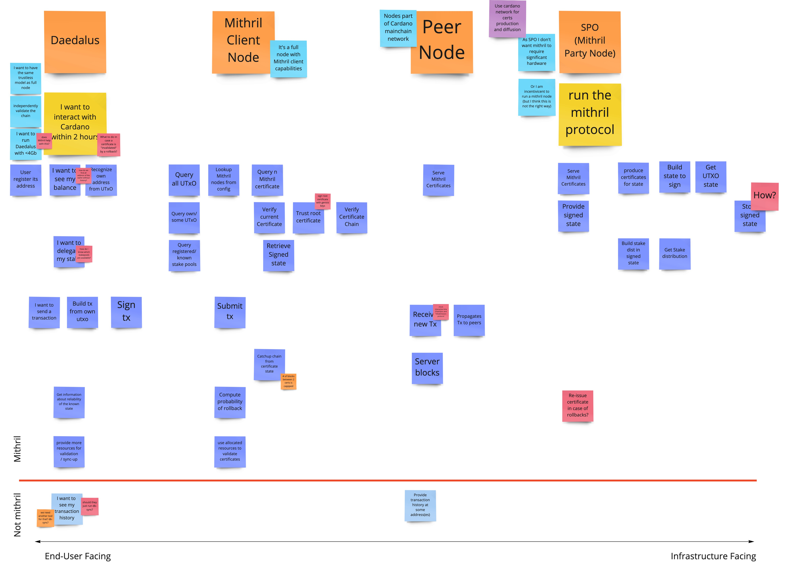

# Milestone Report #1

This document is a summary of the situation of the Mithril project as of January 2022. It aims at providing a comprehensive overview of:
  *  What's been done,
  *  What conclusions we can draw from the various efforts undertaken,
  *  What open questions remain, and
  *  What could be the next steps.

# Current State

## Code

### Mithril library

* Mithril core library has been developed mainly by Galois through September and October 2021 (last commit from `abakst@galois.com` is from November 2).
  * The library weighs in at about 25K LOC
* Development has been monitored closely by Iñigo and Pyrros who reviewed all PRs and also provided significant contributions in particular to provide some polishing on:
  * Unit and integration tests
  * C API,
* The library exposes a C API for all its features and data structures allowing client code to manage the whole protocol. It is built and packaged as a dynamically linked `libmithril.so` which can then linked against by thirdparty code. It's been tested with Go when developing the Mithril node
* The library is throughly tested thanks to:
  * A large set of unit and property-based tests for individual functions and features (code coverage is 68.36%, with 903/1321 lines covered)
  * Integration tests demonstrating the full protocol in Rust,
  * C tests using [gtest](https://github.com/google/googletest) checking C API and integration with the core Rust library,
  * Tests are run in the [Continuous Integration](../.github/workflows/ci.yml) process, both for Rust, C and Go parts,
* It is lacking user-facing "Get started" style documentation but the code is properly documented and the [examples/](../rust/examples) directory contains several detailed examples covering the major use cases for the library.
  * Documentation of the library is published [online](https://input-output-hk.github.io/mithril/mithril/)
* Library also contains implementation of [Ad-hoc Threshold Multi Signatures](https://github.com/input-output-hk/mithril/blob/main/rust/examples/atms.rs#L1) for use in Sidechains. This code should be separated from the Mithril core and become part of another library.

#### Performance & Optimisations

* The library is single-threaded, no effort has been put into parallelizing any of the protocol's operations. However, the protocol's state is maintained in data structures that share nothing (eg. _objects_) so parallelisation is trvially achievable by duplicating data and running signing or other functions
  * Proper parallelisation assessment still needs to be done in order to understand how the library can scale
* The library comes with some micro-benchmarks for the various atomic operations provided.
  * The most expensive operation is the key registration process which is done only once, to setup the protocol's state.
  * Signature verification for 256 signers takes on average 3.6ms

### Go Node

* A Mithril node has been developed by Idyllic Vision in Go
  * It's about 3K LOC
* This node was intended as a _Proof-of-Concept_ development to validate the feasability of running Mithril (full) node as a separate (Layer 2) solution. As such, the goal of this development was to demonstrate the Mithril library can be used by something else than cardano-node to produce signed certificates for some realistically sized UTXO set
* The target architecture has been documented in the [Mithril Network](./mithril-network.md) document
* The actual implementation has the following features:
  * The signature generation process is _leader-based_: The signing process is initiated by a leader that creates a message to sign and requests signatures from the other participants, then aggregates the result and broadcast again the resulting certificates
  * The data is retrieved from a [db-sync](https://github.com/input-output-hk/cardano-db-sync) populated [Postgres](https://www.postgresql.org/) database instance (data is extracted from a Testnet)
  * The Mithril nodes uses the same DB to store the produced certificates
  * The key generation and key registration process is handled in the Rust library but the whole configured signing _Clerk_ can be serialised on disk so that node can start from a known configuration
  * The stakes distribution is statically defined in a configuration file and does not change over the life of the nodes
  * The node exposes a classical REST API that allows clients to retrieve certificates, certificate chains and associated data, eg. the UTXO
  * UTXO are stored in a Merkle Tree and can be retrieved individually along with associated proof. The certificate signs only the root of the Merkle Tree, thus minimising the amount of data clients have to process to validate them

#### Performance

* At this stage it was not deemed necessary to setup a full blown performance analysis of the nodes
* Basic benchmarks run have shown that a node can produce an aggregate multisignature for 10 M UTXO in 3'45''
  * About half of this execution time is spent querying and retrieving the data from the DB
* There has been no attempt so far at scaling the number of nodes but given what we know from the behaviour of the library, it's pretty clear the limiting factor will be the network protocol

# Use Cases

* In parallel with PoC development we have been working with Product Dpt on the use cases for Mithril in order to understand what a path to productisation could look like.
* The Lightwallet workshop that occured early November was an opportunity to better understand the Lightwallet requirements for Mithril, eg. enabling fast and trustless bootstrap of wallets
* We conducted a series of [Story Mapping](https://www.jpattonassociates.com/story-mapping/) sessions from November 2021 until early January 2022 in order to delve into some use cases in more details. These sessions were framed in the context of implementing Mithril for fast bootstrapping of Daedalus.
  

* We distinguished 3 kind of "mithril nodes":
  * The ones that run the signing and certificate issuance protocol, run by SPOs,
  * The so-called _Mithril Client_ nodes that are actually full Cardano nodes with the capability to retrieve and validate certificates,
  * _Peer nodes_ which are full Cardano nodes storing and providing certificates
* These sessions allowed us to uncover important aspects of the integration of Mithril in the Daedalus wallet in order to provide faster "boot" time. Some questions/issues/puzzles that were raised:
  * How does the certificate chain is bootstrapped? We'd need to have root certificate signed by genesis keys?
  * To speed up the time it takes for a user to retrieve her wallet's balance, she needs to filter the UTXO set by the addresses of interest, which implies the wallet knows those,
  * It's unclear if Mithril will help in reducing the amount of resources needed to run a Daedalus wallet,
  * The main (top) story line, _A user can retrieve her wallet balance "quickly"_, already involves quite a few actors and will require significant engineering effort and changes to existing network.
* We have started doing similar exercise in the Lightwallet case but it's very early draft

# Assessment

## Initial Scope

Here is a reminder of the goals for this project as was defined in the _Business Case_.

Prototype implementation of the Mithril signature scheme; not be usable in production without a moderate amount of rewriting, documentation, or refactoring. In summary is a solution for fast-bootstrappable wallet implementation.
* [x] Prototype implementation of the primitives, using well-maintained open source efforts where applicable, implemented in Rust
* [x] Prototype implementation of the concatenation-based protocol from the paper
* [x] Mithril is (for now) exclusively a second layer solution with no new ledger rules to be introduced;
* [x] SPOs will certify the latest UTxO set that the wallet can use at a certain frequency, once per epoch for example;
  > Not really done by SPOs but the implemented node does this certification process
* [x] SPOs will store the latest UTxO set (IPFS or other solutions)
  > UTXO set is served from db-sync which already contains it
* [ ] The wallet will trust the SPO’s certificate to bootstrap from it, downloading the latest UTxO set, and follow the chain then;
* [ ] The wallet will not be able to do history lookup, just validate new transactions;
  > No work has been done with a real wallet but we have evidence that a Mithril-enabled client can be built easily using the same library and validate (chain of) certificates
* [x] Implement the ATMS cryptographic primitive from our PoS Sidechains paper.

Build Network and the data storage stacks (node) and integrate the mithril signature scheme:
> Precise scope was supposed to be refined after a "feasibility study". We can assume the PoC done by IdyllicVision fills this gap

## Risks

The following risks had been identified and we can check whether or not they have been addressed:

* [x] The technical architecture that will be sufficient for the mithril node is not yet well understood. We need to create a node that is sufficient for the purpose of this project. We need to learn the lessons of Hydra and use the most basic structure for the node (impacts delivery timelines and costs).
  > We have a better understanding of what it means to build a standalone layer 2 mithril node. From this early experiment, it seems however this might not be the best solution for deployment of Mithril at the Cardano scale
* [x] It is not known how the fast synchronisation will work with the full node wallets, light wallets, SPOs, exchanges and other node users. This needs to be assessed by the product leadership to understand the utility of this technology for Cardano and other platforms
  > This has been addressed partially in our User Story Mapping sessions
* [ ] Need to understand how prototyping output works with our formal methods approach (this is not clear)
* [x] If we at some point want to incorporate the rust library with the cryptographic primitives in Cardano, we will have to invest a substantial and unknown effort to include another language in our build systems (CI including cross compilation, and developer builds). Otherwise, it's possible to get the impression that that would be easy, given that we will get a Haskell API.
  > Having deliberately implemented library and node in 2 different languages gave us a good understanding of the kind of integration problems we could run in. Notwithstanding the issue of the skillset needed to maintain polyglot systems, integration has been pretty straightforward. Of course there's a lot to be done to productise this process but it seems reasonable to expect we should be able to use the Mithril library from any C-FFI enabled language, including Haskell, straightforwardly
* [ ] It is not clear what is going to happen outside of the PoC and this needs to be defined
  > This document tries to address that risk in the last section
* [ ] Scope is not clear with some stakeholders believing that testing of the prototype should include running in a browser. In this respect it is unclear why we are building a prototype in scala and rust if the end target is running in a browser “One of the main use-cases for this product is "security of a full node and speed of a light client". I'm not expecting this version to be very performant, but I do expect it to run on a mobile device (including a phone).”
  > This has not been addressed at all. Given the specificity of the Mithril crypto primitives this should be
* [ ] The expectation of the wallet user of "full node security and lightwallet experience" is definitely not met by Mirthril according to the product team. Doing some basic research they assert that in bitcoin an SPV wallet would require 100Mb of storage and 512Mb memory. With the Mithril proposal a "similar" wallet would need a very low amount of storage(the paper was eluding to about 142Kb) but ~8Gb of memory.  As part of this project we need to understand next steps in order to meet this expectation.
  > This has been addressed tangentially as it's also not clear how Mithril would be used from a lightwallet client perspective
* [x] We need to identify internal resources to sanity check and maintain this. The choice of rust as a language will cause a problem for us because of resource constraints in this area
  > Inigo did a great job at monitoring development of the library and improving it. Rust is a language with a growing community and interest from a lot of developers. From this PoC phase I don't see why we should not be able to either hire rust specialists should we need to, or have internal developers learn enough of rust to be able to maintain and extend the library.
* [ ] Mithril (fast syncing) use cases include spo’s, consumers, exchanges as well as main chain and side chain. We have not articulated all of the use cases and need to do so in the prototyping stage for a common understanding of expectations. This does not mean we will achieve all of them in prototyping but at least we understand what we would like the technology to do.
  > This was partially addressed by the Lightwallet workshop and User story mapping sessions but of course needs to be ramped up
* [x] We do not know who the customer is for the prototyping output and hence have no idea of who can “accept” or agree the project has met its goals. This is important if this is to be a success.
  > The main goal of this PoC phase was to assess technical feasibility and evaluate possible architecture of the system using an external node.

## Takeaways

* The main takeaway of this stage of the project is obviously that the Mithril protocol _works_ and can be used to provide a chain of certificates on a UTXO Merkle-Tree in such a way that clients can download only a fraction of the UTXO set confidently and verify it
* Implementing the library in Rust and using it from Go was relatively straightforward. The rust library exposes a plain C interface which makes it easy to integrate in any language that can talk to C which really means _any_ language (except Javascript inside a browser)
* Running the Mithril signing protocol requires significant resources (retrieving and storing the UTXO, connecting to and managing networking with peer nodes, storing and delivering certificates) for which there is currently no incentive
* We have barely explored the question of the Mithril network. In the current Go node implementation, nodes are connected using [libp2p](https://libp2p.io/) but we have no idea how this would scale nor whether it fits our needs, which are themselves unclear

# Next steps

## Engineering

* Exploring alternative architectures where data acquisition about the state of the network does not go through db-sync and which could have lighter footprint
  * Still using a standalone node but using node APIs (ChainSync protocol, Ogmios) to retrieve its state and maintaining UTXO set in the node
  * Tighter integration within the node itself
* Designing proper networking solution for connecting Mithril nodes
* Browser-based solution for Mithril certificates validation
  * We don't need a full-blown Mithril library but JS clients need to be able to validate chain of mithril certificates inside a browser context
