## Status

**Draft**

## Context

When we will run Mithril on Mainnet there will be thousands of signers running altogether. Upgrading the version of the nodes has an impact as different versions of API, messages, signature may lead to loss of a significant part of the signers population over one epoch or more. In any case we must prevent a gap in the certificate chain while upgrading critical parts.

We need to be able to keep enough of signer nodes and the aggregator able to work together in order to produce at least one certificate per epoch.

Examples of such changes:

 * change in the message structure
 * change in the cryptographic algorithm
 * change in communication channels

## Decision

In order to synchronize all nodes behavior transition, the Release Team will set up Eras that start at a defined Cardano Epoch and lasts until the next Era begins. When nodes detect an Era change, they switch from old to new behavior hence all transitioning at almost the same time.

## Consequences

### Release Team

The release team is a team of people responsible of releasing new versions of Mithril software. The **Release Team** will be responsible to set the Epoch at which **Eras** change using an **Era Activation Marker**. In order to be able to determine when the new Era shall begin, the Release Team has to know what is the share of the total Mithril stake that can run the new behavior. Signer node software versions has to be **monitored**.

### Version monitoring

The Release Team must be aware of the software version run by the Signer nodes and their associated stake. This information is going to be added to all HTTP headers in internode communication. In a first step, the Aggregator nodes will record this information.

This configuration works in the case there is a centralized Aggregator Node (as it is today). In the future, there may be several Aggregator nodes working in a decentralized manner. This would mean having a separate monitoring service.

### Era Activation Marker

An Era Activation Marker is an information shared amongst all the nodes that specifies the Epoch when they must switch from old to new behavior. The Era Activation Marker will be a transaction in the Cardano BlockChain. This implies the Nodes must be able to at least read the BlockChain.

When a node detects a Marker, it will warn the user if it does not support the incoming Era that he must upgrade his node. If the node detects it does not support the current Era, it will stop working with an explicit error message. To ease that operation, Era Activation Marker will be made sortable.

### Behavior Switch

The nodes must be able to switch from one behavior to another when the Era Epoch is reached. This means the software must embed both behaviors. The switch is developed as a one time figure, there is no flip flop or rollback mechanism intended. Once the Epoch is over and the switch occurred, a new software release can remove the old behavior from the codebase.

```mermaid
sequenceDiagram
    actor Release Team
    actor User
    Old Node->>Chain: What is the last marker?
    Chain->>Old Node: Era change epoch XX
    Release Team--xChain: Set new Era Marker Epoch to YY.
    New Node->>Chain: What is the last marker?
    Chain->>New Node: Era change epoch YY
    Old Node->>Chain: What is the last marker?
    Chain->>Old Node: Era change epoch YY
    Old Node->>User: ⚠️ new Era incoming, please update node
    Note over Old Node,New Node: new Era
    New Node->>Chain: What is the last marker?
    Chain->>New Node: Era change epoch YY
    Note over New Node: switch behavior
    Old Node->>Chain: What is the last marker?
    Chain->>Old Node: Epoch change is YY
    Old Node->>User: 💀 unsupported Era, quit.
```

