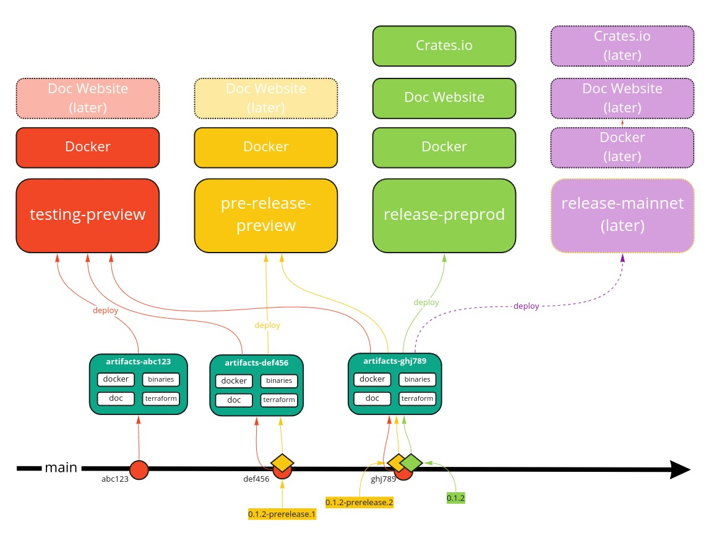

### Mithril should follow a more defined release process

As the Mithril project grew and more and more SPOs became involved in testing Mithril, it became obvious we need clearer identification of artifacts running on various parts of the network. Moreover, on our road towards mainnet availability we'll need to strengthen our testing process in order to validate Mithril network on more realistic environments.

### Release Process

We want our release process to follow some basic principles:
  * _Continuous Integration_: New code is integrated into the `main` codeline frequently which triggers automated build and test process
  * _Continuous Deployment_: New artifacts produced by the build process are continuously deployed to a suitable _environment_ where it can be used and tested by an increasing number of parties
  * _Deployment Pipeline_: The deployment process is embodied in a _pipeline_ that describes and implements all the necessary steps to release a new version of Mithril
  * _Artifact Promotion_: An artifact is built _once and only once_ and is _promoted_ while travelling through the build pipeline

Here is a high-level picture of this process:

* We will use a common version base on [SemVer](https://semver.org) for all the crates, binaries and containers of the repository and for the GitHub release
  * (_OPTIONAL_): We might want to have a different version for the mithril-core library
* We release a new version every 2 weeks (this duration is subject to changes as the project matures)
  * The released version can be major or minor depending on whether or not it contains breaking changes that will break compatibility with previously released components
  * In case of critical regressions happening in production, a patch version can be released in between "official" releases
* A new version `0.1` will have the following life cycle:
    * A commit `abc123` merged on `main` branch is deployed on `testing` environment named `testing-preview`
    * A commit `def456` tagged with `0.1-prerelease1` is deployed on `preprod` environment named `pre-release-preview`
    * A GitHub release `0.1` is created and linked with the `0.1-prerelease1` tag and marked as `pre-release`
    * A tag `0.1-prerelease1` is qualified and selected for release or rejected (and replaced by a `0.1-prerelease2` tag if necessary on a `ghj789`)
    * If the tag `0.1-prerelease1` is selected, a new tag is created and name `0.1` on the same commit `def456`
    * The GitHub release is linked to the `0.1` tag and marked as `release`
    * The commit `def456` with tag `0.1` is deployed to the `prod` environment named `release-preprod`
* The `cargo.toml` version is always set to the _next_ version when a version is cut.
  * eg. when we release version `0.1` we set the versions in  `cargo.toml` to `0.2`
  * breaking changes should be accompanied with the corresponding update of `cargo.toml`
* In order to simplify the life of Mithril users, we should introduce versions of:
  * The `Network Protocol` used between signers and aggregators, smoothly (backward compatibility of messages w/ [`Avro`](https://avro.apache.org/) or [`Protocol Buffer`](https://developers.google.com/protocol-buffers/) or equivalent solution?)
  * The `Client API` used between clients and aggregators
* Our main distribution artefact is currently docker (OCI) images. In the future we will provide more packages, eg. `.deb` or `RPM` packages to simplify us
ers' life

### Environments

* We maintain different "environments" (eg. servers, VMs, configurations...) to which artifacts are deployed at various stages of the process
  * `testing`: This is an internal environment where most of the automated tests happen. It's based on an transient cluster of cardano nodes which is deployed and run in an ad hoc way,
  * `preview`: This is a persistent environment based on the `preview` cardano testnet. SPOs which are active on preview are welcomed to take part in the Mithril signing process and to test new versions deployed there,
  * `preprod`: Another persistent environment where more SPOs are expected to join and test, updated less frequently (on actual releases),
  * (_LATER_) `mainnet`: Production environment where new releases  are deployed once qualifed on `preprod`

### Remaining Issues

- It's not clear how to handle real SPOs on the `testing-preview` and  `pre-release-preprod` environments (vs key rotations, secret keys management, ...)?
