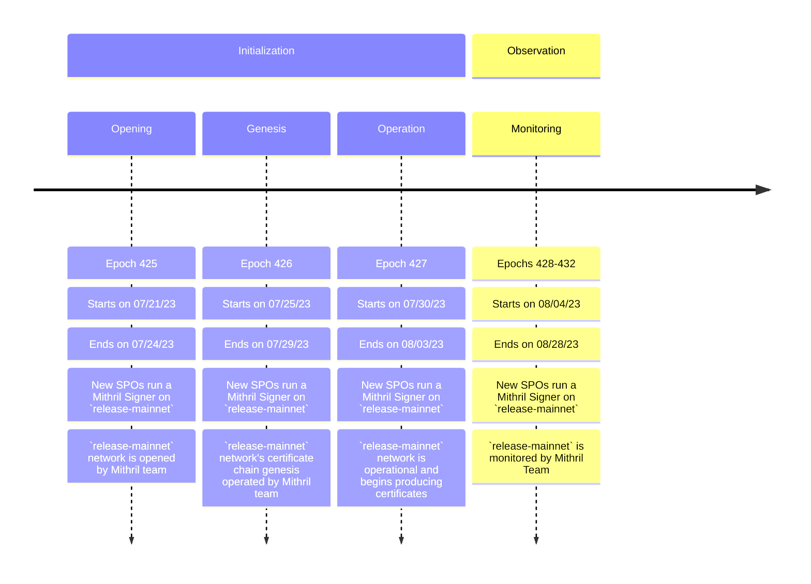

### Mithril Protocol’s Mainnet Beta is launched :rocket:

The Mithril team is thrilled to announce that the **Mithril Protocol’s Mainnet Beta** is launched :tada:

Here are the next steps that we will follow in order to get the `release-mainnet` network producing its first certificates:

1. Open the first signers registrations on the `release-mainnet` network (1 epoch).
1. Create the genesis certificate of the `release-mainnet` network (1 epoch).
1. Wait for the first certificates to be produced by the `release-mainnet` network.

<!---
This diagram randomly crashes. We replace it with a screenshot until a fix is available
TODO: revert this modification when it is possible

-->

This is an expected timeline, in case of modification, we will amend this post with a new one.

Also, the documentation has been updated with the configuration of the `release-mainnet` network. It is available [here](https://mithril.network/doc/manual/developer-docs/references#mithril-networks).

:::danger

As a Cardano SPO, before being able to setup a Mithril signer on the `mainnet`, it is required to complete the **step 2** of the [SPO onboarding guide](https://mithril.network/doc/manual/getting-started/SPO-on-boarding-guide#step-2-get-mithril-ready-for-mainnet)

:::

Feel free to reach out to us on the [Discord channel](https://discord.gg/5kaErDKDRq) for questions and/or help.
