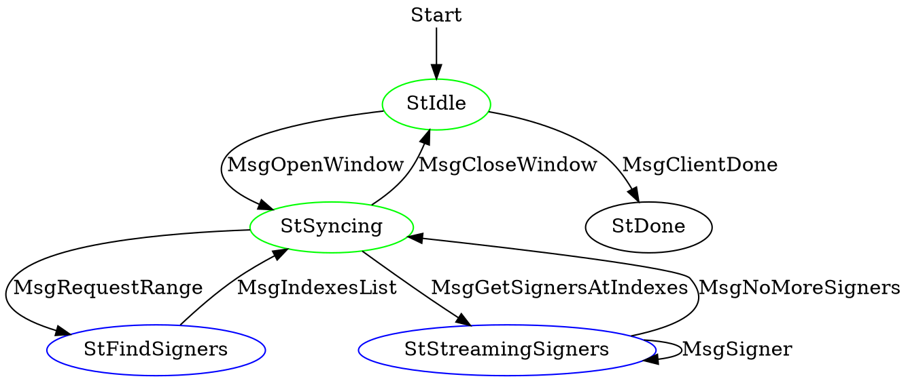
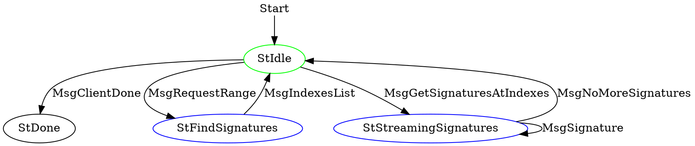
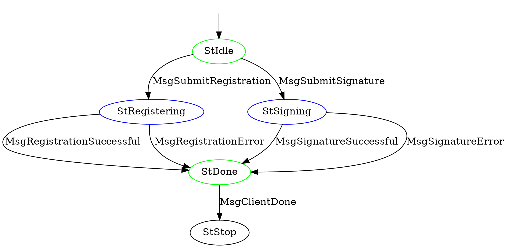
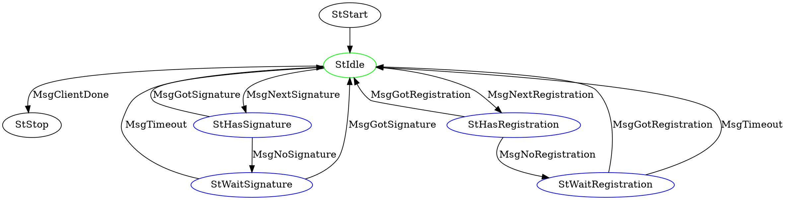

# Abstract

We propose to integrate Mithril Signer and Aggregator nodes in a non-intrusive way side by side Cardano node in order to be able to use the Cardano network layer for Mithril inter-node communications.

In this way, we can significantly reduce the cost and effort required to build a decentralised network for Mithril by using Cardano's established infrastucture, with negligible to no impact on the performance and no impact on the security of the Cardano network.

# Motivation
 
Mithril is a protocol based on [Stake-based Threshold Multisignatures](https://iohk.io/en/research/library/papers/mithril-stake-based-threshold-multisignatures/) scheme which efficiently produces certificates which can be used in a trustless way. There are several usecases envisaged for the Cardano ecosystem such as fast bootstrapping of full nodes, enabling secure light wallets, and decentralised voting. 

There are several key components and requirements that need to be in place:
* a decentralised network of communicating nodes, consisting of Signers and Aggregators, refered to as Mithril network.
* independent and direct access by individual Mithril nodes to chain data
* almost all of Cardano's active stake is represented by Mithril network 

Such a network, if built from the ground up, would require significant efforts and investment. Furthermore, the majority of SPO's, as the representatives of Cardano's active stake, will have to adopt and operate Mithril nodes alongside their Cardano node. This is not guaranteed without a sustainable incentive scheme in place due to the additional maintenance and operational costs. Mithril is a lightweight protocol with respect to both computation and network communication overhead and has less strict network guarantees requirements than Cardano consensus. Thus a natural solution is to use the Cardano network layer to significantly facilitate the development of Mithril protocol without a significant impact on the Cardano network or high maintenance efforts for the SPOs. The proposed solution is described in detail below. 

# Specification

## Overview


This specification proposes to create `4` new mini-protocols in the Cardano network layer:
* `node-2-node` mini-protocols:
  * [**Mithril Signer Registration Protocol**](#Mithril-Signer-Registration-Protocol): Diffusion of the signer registration requests on the network.
  * [**Mithril Signature Protocol**](#Mithril-Signature-Protocol): Diffusion of the signer signatures on the network.
* `node-2-client` mini-protocols:
  * [**Mithril Local Submission Protocol**](#Mithril-Local-Submission-Protocol): Local submission of a signer registration by a Mithril signer.
  * [**Mithril Local Notification Protocol**](#Mithril-Local-NotificationN-Protocol): Local notification of other signers registration requests and signatures, used by a Mithril Signer or Aggregator.

## Mithril Signer Registration Protocol

> This protocol is run in the node-2-node stack.

This is the protocol driving the diffusion of signers registration across the network. The purpose of this protocol is to ensure timely diffusion of each signer's registration for the next epoch.


:::danger
How do we avoid last minute registrations from malicious players? Even if we have a time window for registering, we still need to allow for some marging so that messages reach the full network. But what stops adversaries from sending a registration request off-limits of the time-window? This is important, because if honest nodes have registrations with different users, their signatures will not be compatible for aggregation.
:::

:::warning
There's a need to limit the time range during which we allow for registration to be sent and to be received, as we want to avoid last minute flooding of registrations that would create discrepancy between signers that would prevent them from signing.
:::

:::info
In order to achieve consensus on the signer registrations, a solution  could be having the SPOs create a transaction on the main chain to register their Mithril verification keys (once every epoch or `k` epochs if a KES like mechanism is possible).
:::

### Protocol Summary

* For each epoch, the protocol handler at each node maintains an ordered map of pool ids and Mithril signer registration requests.
* A node can ask its neighbours to give registration requests for a range of pool ids they have registration for a given epoch:
  ```
  haveSignersFor?(range = [0, 100])
  ```
* Neighbour answers with the list it has available:
  ```
  hasSigners!( list = [id_x, id_y, ..., id_z])
  ```
* Node can ask for signers' registrations within list of pool ids it has not synchronized yet, which put the node in streaming mode:
  ```
  -> giveMeSigners(list = [id_x, id_y])
  <- signer(signer = id_x, registration = "0xcafe")
  <- signer(signer = id_y, registration = "0xcafe") 
  ...
  <- noMoreSigners
  ```
* A node can also be engaged simultaneously with another neighbour into a symmetric signer registration diffusion process.

We expect this protocol to guarantee that if a node has emitted a signer registration for a given epoch, it will reach all signers before the end of the epoch. Or in other words, the set of registered signers **must** be identical for each signer node.

The pull system should ensure convergence of state for all involved nodes within the timespan of an epoch.

### Protocol Logic 

There is a delicate topic regarding the collection of signers' registration:
* The signers' table to be consistent among enough nodes
* The Cardano network should provide this consistency given the guarantee that it will broadcast a message to all the nodes within a delay.
* The system must be able to reach consensus even if adversaries are participating (and misbehaving)

There is a need to define `openWindow` and `closeWindow`, which corresponds to the time we allow for registration (or when we decide to stop accepting registrations). These values could be tied to epoch numbers, or the security parameter `k`. 

:::danger
This problem is not trivial, and by no means resolved. We should check with the rest of the team (consensus/ledger/network) whether it makes sense to treat registration requests in a similar way as blocks are treated (e.g. registration pool waiting to be included in a 'RegistrationBlock'). If we treat them as such, then the 'k' parameter is again relevant for agreeing on 'when' a fork can no longer happen.
:::

### Protocol Description

| Agency ||
|--------|------| 
| Client has Agency | StIdle, StSyncing | 
| Server has Agency | StFindSigners, StStreamingSigners |



### State Machine

#### Protocol messages:

* **MsgOpenWindow**: The signer registration synchronization window is open.
* **MsgCloseWindow**: The signer registration synchronization window is closed.
* **MsgRequestRange(range)**: The client requests a range of registration requests.
* **MsgIndexesList(list)**: The server returns the list of indexes of signers he can provide to the client.
* **MsgGetSignersAtIndexes(list)**: The client asks for a list of registrations to the server given a list of signers indexes.
* **MsgSigner(signer_registration)**: The server streams a single signer registration.
* **MsgNoMoreSigners**: The server ends streaming the signers' list.
* **MsgClientDone**: The client terminates the protocol.

#### Transition table:

| From state | Message | Parameters | To State|
|--------|------|----|----| 
| StIdle | MsgOpenWindow | | StSyncing | 
| StSyncing | MsgRequestRange | range | StFindSigners| 
| StFindSigners | MsgIndexList | list | StSyncing |
| StSyncing | MsgGetSignersAtIndexes | list | StStreamingSigners |
| StStreamingSigners | MsgSigner | signer_registration | StStreamingSigners |
| StStreamingSigners | MsgNoMoreSigners | | StSyncing |
| StSyncing | MsgCloseWindow | | StIdle |
| StIdle | MsgClientDone | | StDone |

### Data Description / CDDL encoding specification


```cddl
1
2 signerRegistrationMessage
3 = msgOpenWindow
4 / msgCloseWindow
5 / msgRequestRange
6 / msgIndexesList
7 / msgGetSignersAtIndexes
8 / msgSigner
9 / msgNoMoreSigners
10 / msgClientDone
11
12 msgOpenWindow = [ 0 ]
13 msgCloseWindow = [ 1 ]
14 msgRequestRange = [ 2, point , point ]
15 msgIndexesList = [ 3,  * point]
16 msgGetSignersAtIndexes = [ 4 , * point ]
17 msgSigner = [ 5,  signer_registration ]
18 msgNoMoreSigners = [ 6 ]
19 msgClientDone = [ 7 ]
20 
21 signer_registration =
22   [ registration_header
23   , party_index: word16
24   , party_id : bech32
25   , verification_key   : base64
26   , verification_key_signature   : base64
27   , operational_certificate : base64
28  ]
```

## Mithril Signature Protocol

> This protocol is run in the node-2-node stack.

This is the protocol driving the diffusion of signers signatures across the network. The purpose of this protocol is to ensure timely diffusion of each signer's signature for the current signing round. 

A signing round is an event that is defined as:
- Occurring at least once per epoch.
- Computed deterministically by all the signer nodes by querying the Cardano state/chain.

### Protocol Summary

* For each signing round, the protocol handler at each node maintains an ordered map of pool ids and Mithril signer signatures requests.
* A node can ask its neighbours to give signatures requests for a range of pool ids they have registration for a given epoch:
  ```
  haveSignaturesFor?(range = [0, 100])
  ```
* Neighbour answers with the list it has available:
  ```
  hasSignatures!( list = [id_x, id_y, ..., id_z])
  ```
* Node can ask for signers' signatures within list of pool ids it has not synchronized yet, which put the node in streaming mode:
  ```
  -> giveMeSignatures(list = [id_x, id_y])
  <- signature(signer = id_x, signature = "0xcafe")
  <- signature(signer = id_y, signature = "0xcafe")
  ...
  <- noMoreSignatures
  ```
* A node can also be engaged simultaneously with another neighbour into a symmetric signer signature diffusion process.

### Protocol Description

| Agency ||
|--------|------| 
| Client has Agency | StIdle | 
| Server has Agency | StFindSignatures, StStreamingSignatures |



### State Machine

#### Protocol messages:

* **MsgRequestRange(range)**: The client requests a range of signatures requests.
* **MsgIndexesList(list)**: The server returns the list of indexes of signers for which he can provide signatures to the client.
* **MsgGetSignaturesAtIndexes(list)**: The client asks for a list of signatures to the server given a list of signers indexes.
* **MsgSignature(signer_signature)**: The server streams a single signature.
* **MsgNoMoreSignatures**: The server ends streaming the signatures' list.
* **MsgClientDone**: The client terminates the protocol.

#### Transition table:

| From state | Message | Parameters | To State|
|--------|------|----|----| 
| StIdle | MsgRequestRange | range | StFindSignatures| 
| StFindSignatures | MsgIndexList | list | StIdle |
| StIdle | MsgGetSignaturesAtIndexes | list | StStreamingSignatures |
| StStreamingSignatures | MsgSignature | signer_signature | StStreamingSignatures |
| StStreamingSignatures | MsgNoMoreSignatures | | StIdle |
| StIdle | MsgClientDone | | StDone |

### Data Description / CDDL encoding specification


```cddl
1
2 signerSignatureMessage
3 = msgRequestRange
4 / msgIndexesList
5 / msgGetSignaturesAtIndexes
6 / msgSignature
7 / msgNoMoreSignatures
8 / msgClientDone
9
10 msgRequestRange = [ 0, point , point ]
11 msgIndexesList = [ 1,  * point]
12 msgGetSignaturesAtIndexes = [ 2 , * point ]
13 msgSignature = [ 3,  signer_signature ]
14 msgNoMoreSignatures = [ 4 ]
15 msgClientDone = [ 5 ]
16 
17 signer_signature =
18   [ signature_header
19   , party_index: word16
20   , single_signature   : base64
21   , won_lotteries   : * point
22  ]
```

## Mithril Local Submission Protocol

> This protocol is run in the node-2-client stack.

This is the protocol used by signers to broadcast their registration and signatures. Note that this protocol allows a signer to send _both_ their registration for a given epoch and their signature for a given signing round.

### Summary

* Client (Mithril signer) gets a trigger to register for a new epoch.
* Client sends signer registration request to Cardano node through local connection.
* Server checks that registration request is valid and adds it to its internal map of registered signers.
* Process is exactly the same for signatures but happens more often (once per signing round instead of once per epoch)

### Protocol Description

| Agency ||
|--------|------| 
| Client has Agency | StIdle, StDone | 
| Server has Agency | StRegistering, StSigning |



### State Machine

#### Protocol messages:

* **MsgSubmitRegistration(signer_registration)**: The client submits a signer registration.
* **MsgRegistrationSuccessful**: The server returns success for the signer registration.
* **MsgRegistrationError(error)**: The server returns error for the signer registration.
* **MsgSubmitSignature(signer_signature)**: The client submits a signer signature.
* **MsgSignatureSuccessful**: The server returns success for the signer signature.
* **MsgSignatureError(error)**: The server returns error for the signer signature.
* **MsgClientDone**: The client terminates the protocol.

#### Transition table:

| From state | Message | Parameters | To State|
|--------|------|----|----| 
| StIdle | MsgSubmitRegistration | signer_registration | StRegistering| 
| StRegistering | MsgRegistrationSuccessful |  | StDone |
| StRegistering | MsgRegistrationError | error | StDone |
| StIdle | MsgSubmitSignature | signer_signature | StSigning |
| StSigning | MsgSignatureSuccessful |  | StDone |
| StSigning | MsgSignatureError | error | StDone |
| StIdle | MsgClientDone | | StDone |

### Data Description / CDDL encoding specification


```cddl
1
2 localSubmissionMessage
3 = msgSubmitRegistration
4 / msgRegistrationSuccessful
5 / msgRegistrationError
5 / msgSubmitSignature
6 / msgSignatureSuccessful
7 / msgSignatureError
8 / msgClientDone
9
10 msgSubmitRegistration = [ 0, signer_registration ]
11 msgRegistrationSuccessful = [ 1 ]
12 msgRegistrationError = [ 2 , error ]
13 msgSubmitSignature = [ 3,  signer_signature ]
14 msgSignatureSuccessful = [ 4 ]
15 msgSignatureError = [ 5 , error ]
16 msgClientDone = [ 6 ]
17
18 signer_registration =
19   [ registration_header
20   , party_index: word16
21   , party_id : bech32
22   , verification_key   : base64
23   , verification_key_signature   : base64
24   , operational_certificate : base64
25  ]
26
27 signer_signature =
28   [ signature_header
29   , party_index: word16
30   , single_signature   : base64
31   , won_lotteries   : * point
32  ]
33
34 error = 
35   [ error_message : tstr]
33 
```

## Mithril Local Notification Protocol

> This protocol is run in the node-2-client stack.

This is the protocol used by signers and aggregators to be notified of registration and signatures of signers.

### Summary

* Client requests _next signature_ for current signing round from server.
* Server sends the next available signature from the currently available signature map ($\implies$ server maintains a tally of sent signatures).
* Server sends `MsgNoSignature` if there aren't more signatures.
* Process is exactly the same for registrations.

### Protocol Description

| Agency ||
|--------|------| 
| Client has Agency | StIdle, StStop | 
| Server has Agency | StHasSignature, StWaitSignature, StHasRegistration, StWaitRegistration |


:::info
The following state machine does not represent the full semantics of the Mithril protocol, which requires to collect registrations for an epoch before collecting signatures for the next epoch.
:::

### State Machine

#### Protocol messages:

* **MsgNextRegistration(signer_registration)**: The server returns the next signer registration.
* **MsgGotRegistration**: The server has no more signer registration to return.
* **MsgNoRegistration**: The server has no more signer registration to return.
* **MsgNextSignature**: The client asks for the next signer signature.
* **MsgGotSignature(signer_signature)**: The server returns the next signer signature.
* **MsgNoSignature**: The server has no more signer signature to return.
* **MsgTimeout**: The server did not answer and times out.

#### Transition table:

| From state | Message | Parameters | To State|
|--------|------|----|----| 
| StIdle | MsgNextRegistration |  | StHasRegistration |
| StHasRegistration | MsgGotRegistration | signer_registration | StIdle |
| StHasRegistration | MsgNoRegistration |  | StWaitRegistration |
| StWaitRegistration | MsgGotRegistration | signer_registration | StIdle | -> StIdle
| StWaitRegistration | MsgTimeout |  | StIdle |
| StIdle | MsgNextSignature |  | StHasSignature |
| StHasSignature | MsgGotSignature | signer_signature | StIdle |
| StHasSignature | MsgNoSignature |  | StWaitSignature |
| StWaitSignature | MsgGotSignature | signer_signature | StIdle |
| StWaitSignature | MsgTimeout |  | StIdle |
| StIdle | MsgClientDone |  | StStop |

### Data Description / CDDL encoding specification

```cddl
1
2 localNotificationMessage
3 = msgNextRegistration
4 / msgGotRegistration
5 / msgNoRegistration
5 / msgNextSignature
6 / msgGotSignature
7 / msgNoSignature
8 / msgTimeout
8 / msgClientDone
9
10 msgNextRegistration = [ 0 ]
11 msgGotRegistration = [ 1 ]
12 msgRegistrationError = [ 2 , signer_registration ]
13 msgNoRegistration = [ 3 ]
14 msgNextSignature = [ 4 ]
15 msgGotSignature = [ 5 , signer_signature ]
16 msgNoSignature = [ 6 ]
17 msgTimeout = [ 7 ]
18 msgClientDone = [ 8 ]
19
20 signer_registration =
21   [ registration_header
22   , party_index: word16
23   , party_id : bech32
24   , verification_key   : base64
25   , verification_key_signature   : base64
26   , operational_certificate : base64
27  ]
28
29 signer_signature =
30   [ signature_header
31   , party_index: word16
32   , single_signature   : base64
33   , won_lotteries   : * point
34  ]
35 
```

# Rationale

## Why are we proposing this CIP?

* Mithril requires strong network foundations to support interactions between its various nodes:
  * Mithril needs to exist in a decentralized context where the aggregation of the multi-signatures can be done by any aggregator node (which is not necessarily a signer node i.e. run by a SPO). 
  * Mithril needs participation of _all_ or _nearly all_ of the Cardano network SPOs to provide maximal security to the multi-signatures embedded in the certificates.
  * Creating a separate network would entail significant costs and efforts (there are  more than 3,000 SPOs which would need to be connected with resilient and secure network, and much more passive nodes).
  * The Cardano network is very efficient for diffusion (e.g. broadcasting) which is precisely what is needed for Mithril.
  * Mithril signer node needs to run on the same machine as the Cardano block producing node (to access the registration keys - KES and OpCert). Given that they have to run on the same machine, it makes sense to use the same network layer, which will also facilitate a high level of participation.

* Why it would be great for Cardano to support Mithril within its network?
  * Mithril is a key part to make the Cardano Ecosystem scalable.
  * Future instances of the Cardano protocol could leverage Mithril signatures (e.g. Ouroboros Leios).
  * There are known benefits for clients (wallets, exchanges, dapps) in being able to synchronise with the full chain state faster than what is currently possible using standard process (e.g. restoring a Daedalus wallet on mainnet is `15-20x` faster with Mithril).
  * Mithril could also be valuable for governance purposes of the Cardano Ecosystem.

* What would be the overhead of operating a Mithril node on the Cardano network?
  * The overhead to the network is very low as there are few messages that need to be exchanged only few times a day (less than `10 signing rounds` a day).
  * There will be as many registration requests as there are SPOs (around `3,500`) per `epoch` (each less than `10KB`): this means at most `~35MB / epoch / Cardano node`.
  * There will be as many signatures as there are 'registered' SPOs (around `3,500`) per `signing round` (each less than `1KB`): this means at most `~3.5MB / signing round / Cardano node` or `~175MB / epoch / Cardano node`.
  * The CPU overhead of a signer is very low as the most intensive part of the process takes a few seconds once for every signing round (less than `10 signing rounds` a day).

# Path to Active

## Acceptance Criteria

1. A Cardano node implementing the previously described mini-protocols is released for production.
2. A Mithril Signer node communicating with the Cardano node through mini-protocols is released.
3. A mithril Aggregator producing multi-signatures embedded into certificates using the mini-protocols is released.

## Implementation Plan

* "Formal" specification of the protocols along with vectors/conformance checker for protocol's structure and state machine logic.
* Validate protocol behaviour with all relevant parties (Network and Node teams).
* Validate performance profile and impact on Cardano network.
* Implement Cardano networking mini-protocols in the Cardano node.
* Implement Cardano local mini-protocols in Mithril Signer and Aggregator nodes.

:::info
A hard-fork of the Cardano chain is not required during this implementation plan.
:::

# Further Reading
* **Mithril: Stake-based Threshold Multisignatures**: https://iohk.io/en/research/library/papers/mithril-stake-based-threshold-multisignatures/
* **The Shelley Networking Protocol**: https://hydra.iohk.io/build/21553193/download/2/network-spec.pdf
* **Mithril Network Architecture**: https://mithril.network/doc/mithril/mithril-network/architecture
* **Mithril Protocol in depth**: https://mithril.network/doc/mithril/mithril-protocol/protocol
* **Mithril Certificate Chain in depth**: https://mithril.network/doc/mithril/mithril-protocol/certificates
* **Fast Bootstrap a Cardano node**: https://mithril.network/doc/manual/getting-started/bootstrap-cardano-node
* **Run a Mithril Signer node (SPO)**: https://mithril.network/doc/manual/getting-started/run-signer-node/

# Copyright

This CIP is licensed under [Apache-2.0](http://www.apache.org/licenses/LICENSE-2.0)
