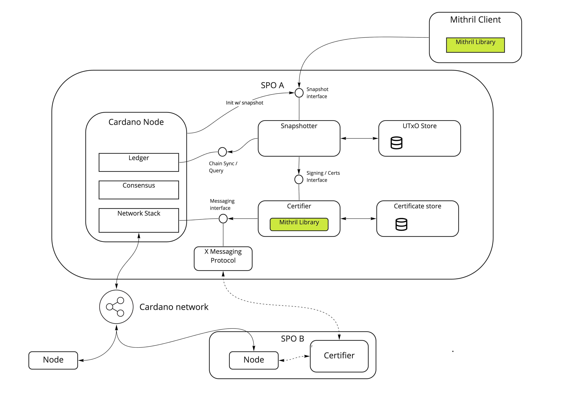
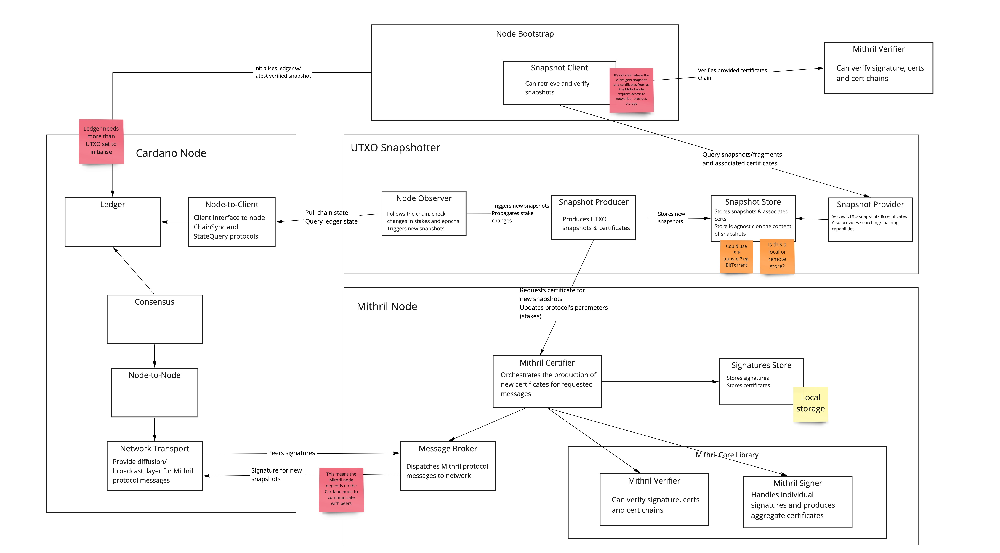

# Mithril Architecture

The following figure sketches of our current understanding of the Mithril network architecture, following initial PoC phase ending in 2021 Q4.

## Containers View

This diagram represents the [Containers view](https://c4model.com/#ContainerDiagram) of the system, where rounded boxes are expected to be separate "Containers" (eg. processes, servers, programs, nodes...)

This architecture is defined in the context of _Bootstrapping nodes_  as primary use case for early development of Mithril.

*  The Mithril containers are more directly linked to the Cardano node, both for querying current state of the chain, initialising the node with some UTXO snapshot, and reusing communication network for Mithril protocol purpose,
*  There's a clear separation between the _Snapshotter_ container that's responsible for deciding when and what to sign, and the _Certifier_ that's responsible for producing valid signatures and certificates,
*  Similarly, the stores for signatures/certificates and the store for snapshots are separated. The latter could be distributed or remote,
*  Alternative messaging layers could be used instead of or beside the Cardano network.

## Components View

This diagram represents the [Components view](https://c4model.com/#ComponentDiagram) of the system, which provides more details on the inner workings of each of the involved containers.

