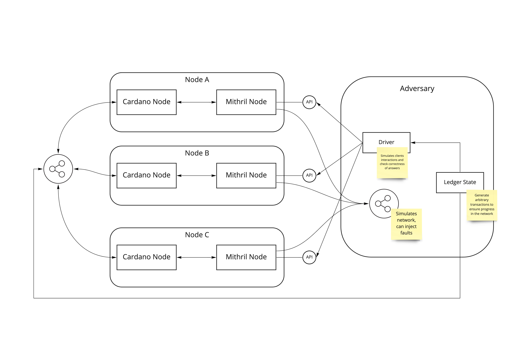

# Mithril Test Lab

The following picture describes in high-level box-and-wire diagram how a Mithril Test Lab would instrument Mithril nodes to run complex adversarial tests.

## Why?

Mithril is both:
1. A somewhat complex protocol to produce Stake based Threshold Multi-signatures. It depends on relatively sophisticated cryptographic algorithms, and mathematical proofs defining security properties and requirements,
2. A set of nodes which run the protocol over a dedicated p2p network, producing signatures, certificates and delivering relevant data to clients.

As the goal of building Mithril network is to provide trusted data to clients without requiring them to run the full chain themselves, it is necessary to ensure the basic properties of the "abstract" protocol are indeed provided by the "concrete" implementation. We plan to reach this goal by developing a _Model-based testing framework_ for Mithril that should be able to check implementation of actual nodes against expected behaviour, under various scenarios and load from "happy path" to "adversarial conditions".

The _Mithril Test Lab_ should be as agnostic as possible about the actual implementation of the nodes.

## What?

The Mithril Test Lab is expected to provide the tooling to build, run, and check the result of those tests. It should be able to:

- Deploy and run a set of Mithril (and Cardano) nodes from some binary packages,
- Control the network through which Mithril nodes are interacting in order to observe the flow of messages related to the Mithril protocol, and intercept them in order to inject delays, reorderings, faults and arbtitrary messages,
- Drive the system from the outside, injecting transactions into the instrumented Cardano network and behaving as clients, interacting with Mithril nodes through their exposed public API,
- Impersonate one or more "normal" Mithril nodes and run_Adversarial_ nodes, trying to "game" the system under various conditions of stakes and degrees of control.

## How?

### 2022-03-07 - Defining a 1st increment

#### Where are we?

* Sketched [monitor](../monitor/README.md) as the way to specify expected behaviour of Mithril network and nodes in Haskell
  * `Monitor`s are _composable observers_ that can _monitor_ the trace of observable behaviour of interconnected Mithril nodes to verify some protocol invariants
  * Users can define basic assertions, properties, invariants, using the language provided by monitors
  * They should also be used to _drive_ the network, eg. decide when to request signature, when to retrieve certificate and verify them...
  * In essence, `Monitor`s are an eDSL somewhat akin to [Free monads](https://serokell.io/blog/introduction-to-free-monads) to represent interesting tests about a Mithril network, or more precisely to represent _executable specifications_
  * Monitors are interesting if thye provide more abstracting power than mere test examples, eg. express composable behaviour, up to interleaving, provided generative power to be able to abstract from details...
* Sketched [Rust mithril node](../mithril-proto/test-node/) which is expected to evolve into some kind of _reference implementation_ of the Mithril protocol
  * As the underlying library is written in Rust, a Rust node should be "easy" to implement and provides more assurance we are actually uysing the protocol right
  * This "node"'s usefulness hinges on the fact it really can be instrumented by the monitors' or an over-arching driver/orchestrator: It does not have to implement all the complexity of networking and orchestration a real node entails, it only serves as an _oracle_ against which to check the actual node's implementation
  * _but_ it's also useful as a way to test the `Monitor` mechanics, and as a surrogate for the real node while we are developing the actual node _and_ the test lab itself
  * Hence the need to have a thin REST layer that exposes an API similar to waht the node provides, which is also a good way to test-drive the real node itself, e.g making it clear what the API should look like in order for the node to be testable
  * However, in this latter role the rust node does not need to implement the protocol in full details, it can just provide canned answers which are _just enough_ to be useful from the monitors' perspective

#### What a first increment should be?

A first concrete deliverable milestone for this project could be made of the following.

* A Design document:
  * There is a general lack of written documentation about the ideas, rationale, design decisions behind all the above, and this is different from implementation-level documentation which _should also_ be there but can be grown piecemeal
  * This document should clarify questions and issues we have been discussing about this project and the chosen approach
  * It should also clarify some plan to move forward past a first increment
* A basic end-to-end scenario:
  * Demonstrates stitching together a network of (dummy, incomplete, lame,...) nodes,in our case the rust node and the monitors in such a way that the latter "drives" the former and observes their behaviour
  * The property/invariant we express does not need to be sophisticated at first, could just be something like:
    > Given a network of n correct nodes and some protocol parameters
    > When monitor issues a signing request for the same item to each of the node
    > Then it observes valid signatures emitted by each of the node
    > And each node can provide a valid certificate

## References

* [Jepsen](https://jepsen.io/) is an implementation of such a MBT framework for verifying _linearizability_ of consensus protocols
* [quickcheck-state-machine](https://github.com/stevana/quickcheck-state-machine)
* [QuickStrom](https://quickstrom.io)
* [Plutus testing framework](https://plutus.readthedocs.io/en/latest/)
