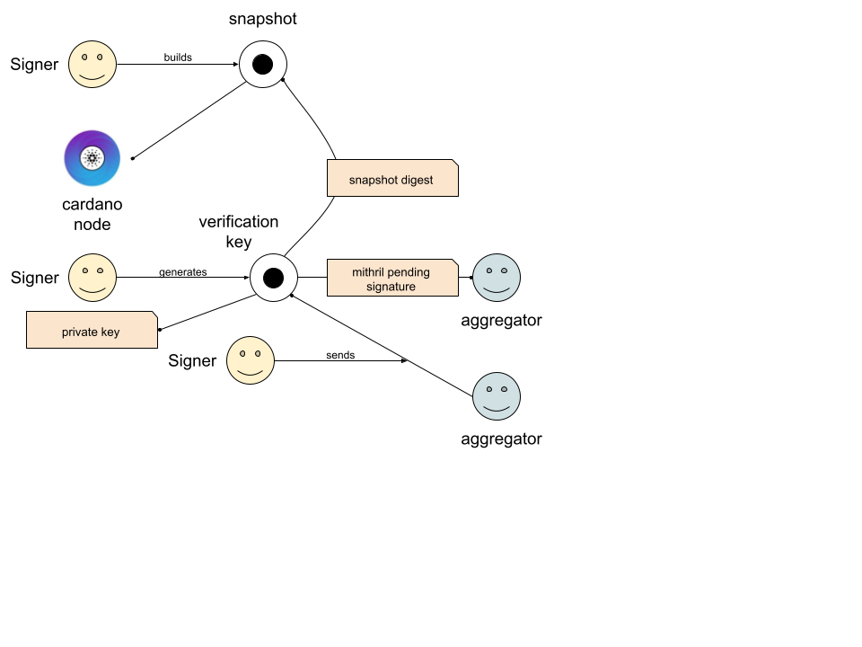
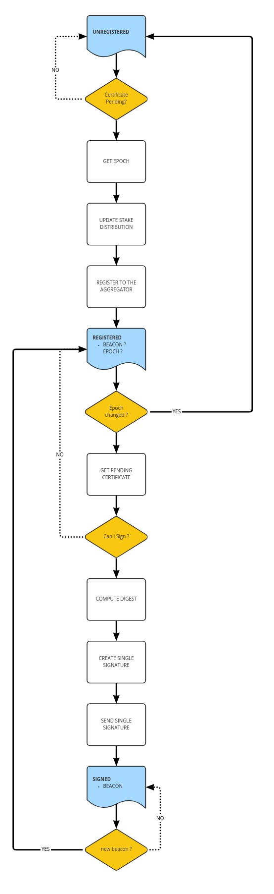

# Mithril Signer Node

 A Signer is a participant to a Mithril Multisignature. As such, a signer contributes to signing an expected genuine message. To do so, the signer computes the digest from the information stored on a Cardano node and signs it with his secret key. This signed message is sent to the Aggregator, along with the corresponding won lottery numbers. This way, the Aggregator can assess that the Signer is identified and has signed the same message.

## Topology

## Process

## Runtime

