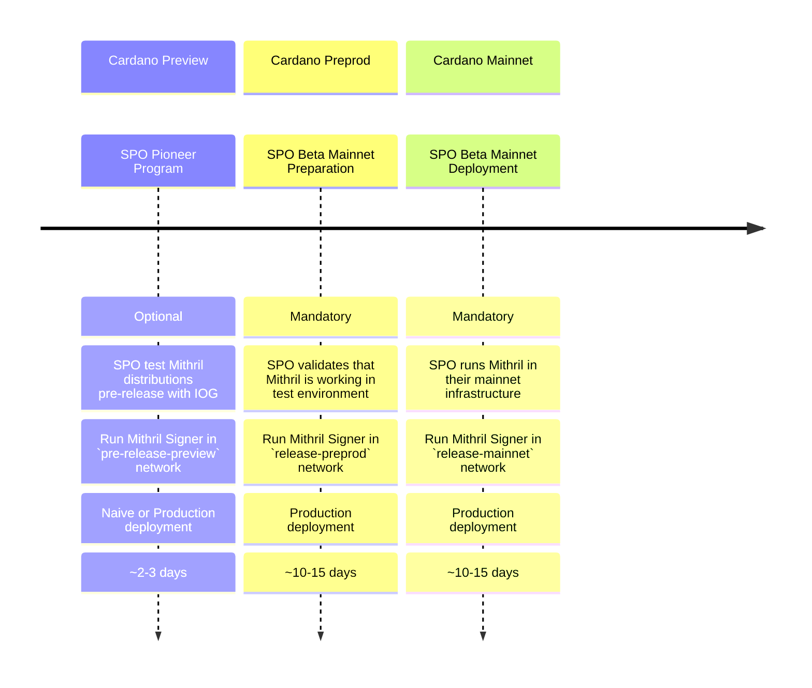

import NetworksMatrix from '../../networks-matrix.md';
import CompiledBinaries from '../../compiled-binaries.md'

# SPO On-boarding Guide

## The journey with Mithril toward `mainnet`

Welcome to Mithril! Here is a description of the journey you will have to follow as a SPO in order to get ready for running a **Mithril Signer** in the `mainnet`.
We are assuming that you are already an active SPO on the Cardano `mainnet` and at least on the `preprod` testnet.

<!---
This diagram randomly crashes. We replace it with screeenshot until aif xi s available
TODO: revert this modification when it is possible

-->

## Step 1: Participate to the Pioneer Program

:::info

This step is **optional**, but recommended as it helps us deliver quality software. We are actively looking for SPO candidates to test Mithril on the Cardano testnets. Contact us [here](https://contact.mithril.network/) if you are interested!

:::

In order to participate to the Pioneer Program, you will need to:
- Register to the **Mithril SPO Pioneer Program** with this [form](https://contact.mithril.network/).
- Run an active SPO on the Cardano `preview` network (registered for a least `1` epoch or `1` day).
- Setup a **Mithril Signer** node on the `pre-release-preview` Mithril network by following the [**Run a Mithril Signer node (SPO)**](run-signer-node.md) guide.
- You can run at your convenience the **Naive** (easier to setup) or the **Production** deployment model.
- Wait for `2` epochs (or `2` days) before your **Mithril Signer** is eligible to contribute.
- Verify that your **Pool Id** is listed in some of the produced certificates with the [**Mithril Explorer**](https://mithril.network/explorer?aggregator=https%3A%2F%2Faggregator.pre-release-preview.api.mithril.network%2Faggregator).
- :warning: Follow our [**#moria**](https://discord.gg/5kaErDKDRq) discord channel or our [**GitHub repository**](https://github.com/input-output-hk/mithril/releases?q=pre) for new pre-releases to install.
- Feel free to ask questions about any technical issue and/or provide feedback on the [**#moria**](https://discord.gg/5kaErDKDRq) discord channel.

Each **Mithril Network** has its own configuration, which is accessible in the [Configuration Parameters](#configuration-parameters) section of this guide.

## Step 2: Get Mithril ready for `mainnet`

:::warning

This step is **mandatory**. You must complete it before moving forward to **Step 3**.

:::

In order to get ready for `mainnet`, you need to:
- Run an active SPO on the Cardano `preprod` network (registered for a least `1` epoch or `5` days).
- Setup a **Mithril Signer** node on the `release-preprod` Mithril network by following the [**Run a Mithril Signer node (SPO)**](run-signer-node.md) guide.
- You **must** run the **Production** deployment model.
- Wait for `2` epochs (or `10` days) before your **Mithril Signer** is eligible to contribute.
- Verify that your **Pool Id** is listed in some of the produced certificates with the [**Mithril Explorer**](https://mithril.network/explorer?aggregator=https%3A%2F%2Faggregator.release-preprod.api.mithril.network%2Faggregator).
- :warning: Follow our [**#moria**](https://discord.gg/5kaErDKDRq) discord channel or our [**GitHub repository**](https://github.com/input-output-hk/mithril/releases/latest) for new releases to install.
- Feel free to ask questions about any technical issue and/or provide feedback on the [**#moria**](https://discord.gg/5kaErDKDRq) discord channel.

Each **Mithril Network** has its own configuration, which is accessible in the [Configuration Parameters](#configuration-parameters) section of this guide.

## Step 3: Run Mithril on the `mainnet`

:::warning

This step is **mandatory**. You must have completed **Step 2** before.

The `release-mainnet` is not available yet, you will be notified when the service is opened.

:::

In order to run **Mithril** on the `mainnet`, you need to:
- Run an active SPO on the Cardano `mainnet` network (registered for a least `1` epoch or `5` days).
- Setup a **Mithril Signer** node on the `release-mainnet` Mithril network by following the [**Run a Mithril Signer node (SPO)**](run-signer-node.md) guide.
- You **must** run the **Production** deployment model.
- Wait for `2` epochs (or `10` days) before your **Mithril Signer** is eligible to contribute.
- Verify that your **Pool Id** is listed in some of the produced certificates with the [**Mithril Explorer**](https://mithril.network/explorer?aggregator=https%3A%2F%2Faggregator.release-mainnet.api.mithril.network%2Faggregator).
- :warning: Follow our [**#moria**](https://discord.gg/5kaErDKDRq) discord channel or our [**GitHub repository**](https://github.com/input-output-hk/mithril/releases/latest) for new releases to install.
- Feel free to ask questions about any technical issue and/or provide feedback on the [**#moria**](https://discord.gg/5kaErDKDRq) discord channel.

Each **Mithril Network** has its own configuration, which is accessible in the [Configuration Parameters](#configuration-parameters) section of this guide.

## Configuration Parameters

:::note Mithril Networks

<NetworksMatrix />

:::
