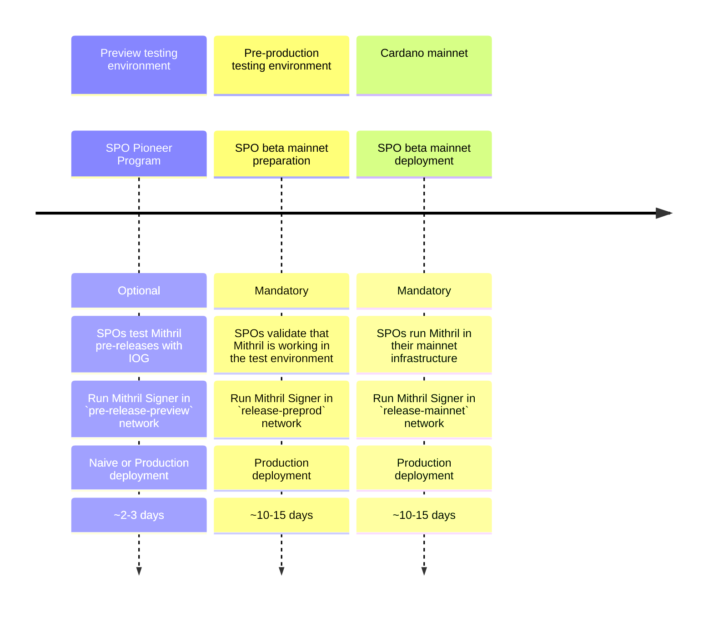

import NetworksMatrix from '../../networks-matrix.md';
import CompiledBinaries from '../../compiled-binaries.md'

# SPO onboarding guide

## The journey with Mithril toward `mainnet`

Welcome to Mithril! Here is a description of the journey you will need to follow as an SPO to prepare for running a Mithril Signer on the `mainnet`. We assume that you are already an active SPO on the Cardano `mainnet` and have experience on the `pre-production` testnet.

<!---
This diagram randomly crashes. We replace it with a screenshot until aif xi s available
TODO: revert this modification when it is possible

-->

## Step 1: Participate in the Pioneer Program

:::info

This step is **optional**, but recommended as it helps us deliver quality software. We are actively looking for SPO candidates to test Mithril on the Cardano testnets. Contact us [here](https://contact.mithril.network/) if you are interested!

:::

To participate in the Pioneer Program, you will need to:
- Register for the **Mithril SPO Pioneer Program** using this [form](https://contact.mithril.network/).
- Run an active SPO on the Cardano `preview` network for at least one epoch or one day. 
- Set up a **Mithril Signer** node on the `pre-release-preview` Mithril network by following the [**Run a Mithril Signer node (SPO)**](run-signer-node.md) guide.
- You can choose between the **Naive** (easier to set up) or the **Production** deployment models.
- Wait for two epochs (or two days) before your **Mithril Signer** is eligible to contribute. Check that your **Mithril Signer** is registered by the Aggregator following [**Verify your signer is registered**](./run-signer-node.md#verify-your-signer-is-registered) steps.
- Verify that your **Pool Id** is listed in some of the produced certificates using the [**Mithril Explorer**](https://mithril.network/explorer?aggregator=https%3A%2F%2Faggregator.pre-release-preview.api.mithril.network%2Faggregator) or following [**Verify your signer contributes with individual signatures**](./run-signer-node.md#verify-your-signer-contributes-with-individual-signatures) steps.
- :warning: Follow our [**#moria**](https://discord.gg/5kaErDKDRq) Discord channel or our [**GitHub repository**](https://github.com/input-output-hk/mithril/releases?q=pre) for new pre-releases to install.
- If you have any technical issues or would like to provide feedback, feel free to ask questions on the [**#moria**](https://discord.gg/5kaErDKDRq) Discord channel.

Each **Mithril network** has its own configuration, which can be found in the [Configuration parameters](#configuration-parameters) section of this guide.

## Step 2: Get Mithril ready for `mainnet`

:::warning

This step is **mandatory**. You must complete it before moving forward to **Step 3**.

:::

To get ready for `mainnet`, you need to:
- Be an active SPO on the Cardano `preprod` network for at least one epoch or five days.
- Set up a **Mithril Signer** node on Mithril's `release-preprod` network by following the [**Run a Mithril Signer node (SPO)**](run-signer-node.md) guide.
- You **must** run the **Production** deployment model.
- Wait for two epochs (or ten days) before your **Mithril Signer** is eligible to contribute. Check that your **Mithril Signer** is registered by the Aggregator following [**Verify your signer is registered**](./run-signer-node.md#verify-your-signer-is-registered) steps.
- Verify that your **Pool Id** is listed in some of the produced certificates using the [**Mithril Explorer**](https://mithril.network/explorer?aggregator=https%3A%2F%2Faggregator.release-preprod.api.mithril.network%2Faggregator) or following [**Verify your signer contributes with individual signatures**](./run-signer-node.md#verify-your-signer-contributes-with-individual-signatures) steps.
- :warning: Follow our [**#moria**](https://discord.gg/5kaErDKDRq) Discord channel or our [**GitHub repository**](https://github.com/input-output-hk/mithril/releases/latest) for new releases to install.
- If you have any technical issues or would like to provide feedback, feel free to ask questions on the [**#moria**](https://discord.gg/5kaErDKDRq) Discord channel.

Each **Mithril network** has its own configuration, which can be found in the [Configuration parameters](#configuration-parameters) section of this guide.

## Step 3: Run Mithril on `mainnet`

:::warning

This step is **mandatory**. You must have completed **Step 2** before.

:::

To run **Mithril** on `mainnet`, you need to:
- Be an active SPO on Cardano `mainnet` for at least one epoch or five days.
- Set up a **Mithril Signer** node on Mithril's `release-mainnet` network by following the [**Run a Mithril Signer node (SPO)**](run-signer-node.md) guide.
- You **must** run the **Production** deployment model.
- Wait for two epochs (or ten days) before your **Mithril Signer** is eligible to contribute. Check that your **Mithril Signer** is registered by the Aggregator following [**Verify your signer is registered**](./run-signer-node.md#verify-your-signer-is-registered) steps.
- Verify that your **Pool Id** is listed in some of the produced certificates using the [**Mithril Explorer**](https://mithril.network/explorer?aggregator=https%3A%2F%2Faggregator.release-mainnet.api.mithril.network%2Faggregator) or following [**Verify your signer contributes with individual signatures**](./run-signer-node.md#verify-your-signer-contributes-with-individual-signatures) steps.
- :warning: Follow our [**#moria**](https://discord.gg/5kaErDKDRq) Discord channel or our [**GitHub repository**](https://github.com/input-output-hk/mithril/releases/latest) for new releases to install.
- If you have any technical issues or would like to provide feedback, feel free to ask questions on the [**#moria**](https://discord.gg/5kaErDKDRq) Discord channel.

Each **Mithril network** has its own configuration, which can be found in the [Configuration parameters](#configuration-parameters) section of this guide.

## Configuration parameters

:::note Mithril networks

<NetworksMatrix />

:::
