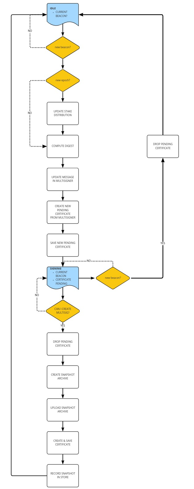

# Mithril Aggregator Node

Welcome to the Mithril Aggregator Node guide!

## Introduction

:::info

The **Mithril Aggregator** is a trustless node that orchestrates the work of the **Mithril Signer** nodes and that gathers their individual signatures to produce **Mithril** multi signatures and their associated certificates. It is also in charge of creating and storing the ledger state snapshot archive.

:::

:::tip

* For more information about the **Mithril Protocol**, please refer to the [Protocol in depth](../mithril-protocol/protocol.md) page.

* For more information about the **Mithril Aggregator**, please refer to the [Developer Documentation](../../manual/developer-docs/nodes/mithril-aggregator.md) page.

:::

## Trustless Orchestration

The primary goal of the **Mithril Aggregator** is to orchestrate and synchronize the **Mithril multi signatures** production:

* When a new snapshot is ready to be produced (and certified), the **Mithril Aggregator** creates and broadcasts a new **Beacon** that indicates to the **Mithril Signers** which point in time they should use to compute the message (or digest) to sign.

* It is also responsible for advertising the **Verification Keys** (Mithril public keys) of all the registered **Mithril Signers**.

* The **Beacon**, the current **Protocol Parameters** and the available **Verification Keys** are gathered and advertised in a **Pending Certificate**.

* The **Mithril Signers** can register with it, in order to be able to later participate in the signature process.

An important fact is that the **Mithril Aggregator** is trustless:

* Anyone could run an aggregator on the network.

* It does not brodcast any _sensitive_ information (such as the _message_ that needs to be signed). The signer nodes are responsible for computing these information directy from a **Cardano Node** on top of which they run.

Also, in order to aggregate single signatures into **Mithril multi signatures**, the *_Mithril Aggregator_ does not need to represent any share of the total stakes of the **Cardano Network**.

## Multi Signature and Certificate Production

The **Mithril Aggregator** is in charge of producing the **Mithril multi signatures** and their associated certificates for a part and/or all of the ledger state (the snapshots):

* The previously registered **Mithril Signers** are able to produce individual signatures. They send these individual signatures to the **Mithril Aggregator** that checks their validaty and then store them.

* Once the **quorum** of individual signatures has been reached, the **Mithril Aggregator** is able to produce a multi signature.

* The **Mithril Aggregator** combines the multi signature and some metadata into a **Mithril Certificate** that will be later used by the **Mithril Client** to verify the authenticity of a snapshot.

:::tip

For more information about the **Mithril Certificate Chain**, please refer to the [Certificate Chain](../mithril-protocol/certificates.md) page.

:::

## Snapshot Artifacts Production

In its first version, the **Mithril Aggregator** also takes care of producing the artifacts associated to the snapshot (e.g. the snapshot archive that will be later used by a **Mithril Client**).

:::note

It is worthy to mention that this role is endorsed only for convenience at the moment, and that on the long run the artifacts production will be delegated to a separate **Mithril Snapshotter** node.

:::

Once the snapshot artifact is created, it can be synchronized anywhere:

* On the **Mithril Aggregator** itself.

* On any cloud platform that provides a CDN.

* On a separate peer to peer network (such as **IPFS** or **Bittorrent**).

The **Mithril Certificate** is part of a chain of certificates that are involved in the snapshot authenticity verification and is stored:

* On the **Mithril Aggregator** itself

* Or on any accessible storage (as a cloud storage for example)

## Snapshot Artifacts and Certificate Distribution

In case the **Mithril Aggregator** stores the snapshot artifacts and/or the certificates, it can be used to distribute these data to remote clients. These clients can use them according to their need and verify that are genuine.

## Under the hood

In its first version, the **Mithril Aggregator** is composed of two main components:

* A REST API, that enables the **Mithril Signers** to:
  * Retrieve other registered signers **Verification Keys**.
  * Register their **Verification Keys**.
  * Register their **Individual Signatures**.

:::tip

The documentation of the REST API of the **Mithril Aggregator** is available [here](/aggregator-api).

:::

* A runtime that is powered by a state machine:
  * The runtime is synchronous and is scheduled to execute at regular intervals.
  * There are two possible states: **IDLE** and **SIGNING**.
  * The runtime handles state transitions.
  * The runtime is summarized in the diagram below:

