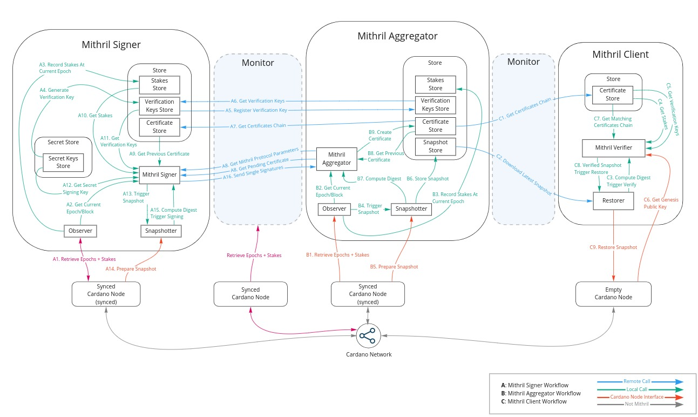

# Mithril network architecture

Welcome to the Mithril network architecture guide.

:::tip

For more information about the Mithril protocol, please refer to the [About Mithril](../mithril-protocol/protocol.md) section.

:::

## Introduction

In its current version, the Mithril network is a network of nodes responsible for creating snapshots and certificates that enable fast bootstrap of a Cardano node. It runs on top of the Cardano network.

:::info

The role of a Mithril network is to enable end users to restore a full Cardano node in less than 2 hours.

:::

It is composed of three nodes:

* [**Mithril aggregator**](./aggregator.md):

> The trustless node that orchestrates the work of the Mithril signer nodes and that gather their individual signatures to produce Mithril multi-signatures and their associated certificates. It is also in charge of creating and storing the ledger state snapshot archive.

* [**Mithril signer**](./signer.md):

> The node that works transparently on top of the stake pool operator Cardano nodes and individually signs the ledger state.

* [**Mithril client**](./client.md):

> The node used to restore a Cardano full node by retrieving a remote snapshot and its certificate chain from a Mithril aggregator and verifying their validity thanks to the Mithril cryptographic primitives.

## Architecture overview

:::info

* This document is subject to change as it is a work in progress.
* The team is currently working on further decentralizing the somewhat centralized architecture.

:::

