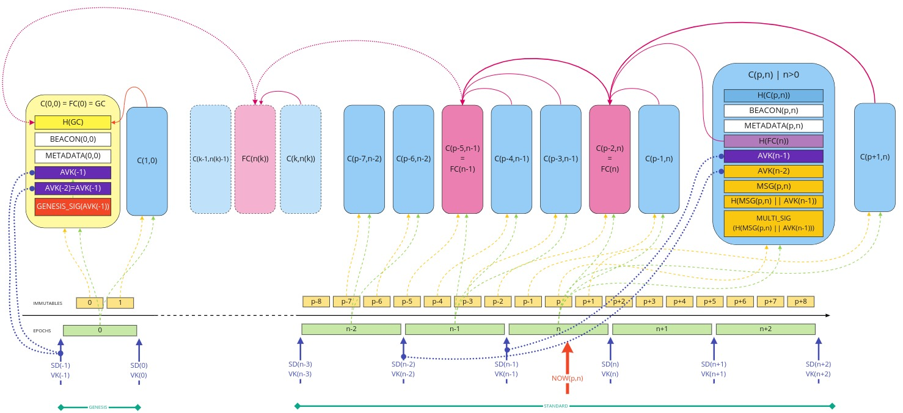

# Mithril certificate chain in depth

## Introduction

The **Mithril protocol** can be summarized as:

> A protocol that enables stakeholders in a proof-of-stake blockchain network to individually sign messages. These signatures are then aggregated into a multi-signature, ensuring that stakeholders collectively represent a minimum share of the total stake.
  
The **certificate chain** is a Mithril component that certifies the **stake distribution** used to create the multi-signature. Its primary purpose is to prevent adversaries from executing an **eclipse attack** on the blockchain.  

Without the certificate, the stake distribution can't be trusted. A malicious actor could relatively easily create a fake stake distribution and use it to produce a valid multi-signature, which would be embedded in a valid but non-genuine certificate. This certificate could be served by a dishonest Mithril aggregator node, leading an honest Mithril client to restore a non-genuine snapshot.  

## The certificate chain design

:::danger

The stake distribution of an epoch is computed by **Cardano nodes** at the end of each epoch. It becomes usable from the beginning of the following epoch.

:::
The way to certify the stake distribution used to create a multi-signature is by verifying that it has been previously signed in an earlier certificate. Then, one can recursively verify that the earlier certificate is valid in the same manner. This process can be structured as a chain of certificates, known as the Mithril certificate chain. The first certificate in the chain is discussed below.

Since multiple certificates can be created during the same epoch using the same stake distribution, it is not necessary to link to all of them for verification. Instead, it is sufficient to link to only one certificate from the previous epoch. By doing so, the verification process becomes faster and helps avoid network congestion. 

The first certificate in the certificate chain is known as the **genesis certificate**. Validating the stake distribution embedded in the genesis certificate is only possible by signing it with a private key linked to a widely accessible public key called the **genesis key**. The use of these specific keys ensures the integrity and security of the initial stake distribution and subsequent transitions within the blockchain network.

The diagram below presents the certificate chain design:
[](images/certificate-chain.jpg)

Where the following notations have been used:

* `C(p,n)`: Certificate at trigger `p` and epoch `n`
* `FC(n)`: First certificate of epoch `n`
* `GC`: Genesis certificate
* `H()`: Hash
* `SD(n)`: Stake distribution of epoch `n`
* `VK(n)`: Verification key at epoch `n`
* `AVK(n)`: Aggregrate verification key at epoch `n` such as `AVK(n) = MKT_ROOT(SD(n) || VK(n))`
* `MKT_ROOT()`: Merkle-tree root
* `BEACON(p,n)`: Beacon at trigger `p` and epoch `n`
* `METADATA(p,n)`: Metadata of the certificate at trigger `p` and epoch `n`
* `MSG(p,n)`: Message of the certificate at trigger `p` and epoch `n`
* `MULTI_SIG(p,n)`: Multi-signature created to the message `H(MSG(p,n) || AVK(n-1))`
* `GENESIS_SIG(MSG)`: Genesis signature, the signature of `MSG` with the genesis keys

The hash of a certificate `H(C(p,n))` is computed as the concatenation (`||`) of all its fields. Therefore, if one field is modified, its hash is different.

Information embedded in the `METADATA(p,n)` field:

* The version of the Mithril protocol
* The parameters of the Mithril protocol (`k`, `m`, and `phi_f`)
* The date and time at which the multi-signature creation was initiated
* The date and time at which the certificate was sealed
* The list of the signers that actively contributed to the multi-signature.

The message `MSG(p,n)` is a map of multiple values associated with their respective keys. It provides a way to add more information to the certificates without breaking the chain itself. Added items can be any message that the signers can compute deterministically thanks to the Cardano consensus – an immutable files snapshot, the UTXO set, stake distribution, etc.

:::note

The **trigger** represents the instant at which a certificate should be created. It is combined with at least the associated **epoch** to create a [**beacon**](../../glossary.md#beacon) of the certificate. In the current implementation of the Cardano node database snapshot, this trigger is a new [**immutable file number**](../../glossary.md#immutable-file-number). 

:::

:::info

The **aggregate verification key** (`AVK`) is the root of the Merkle tree where each leaf is filled with `H(STAKE(signer) || VK(signer))`. It represents the corresponding stake distribution in a condensed way.
:::

## The verification algorithm

Certificate chain verification can be stated as:

```
CHAIN_VERIFY[C(p,n(p))] = CERT_VERIFY[C(p,n(p)] ^ CERT_VERIFY[FC(n(p))] ^ CERT_VERIFY[FC(n(p)-1)] ^ ... ^ CERT_VERIFY[FC(1)] ^ CERT_VERIFY[GC]
```

Where the following notations have been used:

* The epoch `n(p)` depends on the trigger `p`
* `CHAIN_VERIFY[]`: verify all the chain backward from a certificate
* `CERT_VERIFY[]`: verify a specific certificate.

A certificate chain is considered valid when there is at least one valid certificate per epoch, starting from a certificate and going all the way up to the genesis certificate of the chain.

A **non-genesis certificate** is valid if and only if the `AVK` used to verify the multi-signature is also part of the signed message used to create a valid multi-signature in a previously sealed certificate.

The genesis certificate is valid if and only if its genesis signature is verified with the advertised public genesis key.

An implementation of the algorithm would work as follows for a certificate:

* **Step 1**: Use this certificate as the `current_certificate`
* **Step 2**: Verify (or fail) that the `current_hash` of the `current_certificate` is valid by computing it and comparing it with the `hash` field of the certificate
* **Step 3**: Get the `previous_hash` of the `previous_certificate` by reading its value in the `current_certificate`
* **Step 4**: Verify (or fail) that the `multi_signature` of the `current_certificate` is valid
* **Step 5**: Retrieve the `previous_certificate` that has the hash `previous_hash`:
  * **Step 5.1**: If it is not a `genesis_certificate`:
    * **Step 5.1.1**: Verify (or fail) that the `previous_hash` of the `previous_certificate` is valid by computing it and comparing it with the `hash`` field of the certificate:
    * **Step 5.1.2**: Verify the `current_avk`:
      * **Step 5.1.2.1**: If the `current_certificate` is the `first_certificate` of the epoch, verify (or fail) that the `current_avk` of the `current_certificate` is part of the message signed by the multi-signature of the `previous_certificate`
      * **Step 5.1.2.2**: Else verify (or fail) that the `current_avk` of the `current_certificate` is the same as the `current_avk` of the `previous_certificate`
    * **Step 5.1.3**: Verify (or fail) that the `multi_signature` of the `previous_certificate` is valid
    * **Step 5.1.4**: Use the `previous_certificate` as `current_certificate` and start again at **Step 2**
  * **Step 5.2**: If it is a `genesis_certificate`:
    * **Step 5.2.1**: Verify (or fail) that the `previous_hash` of the `previous_certificate` is valid by computing it and comparing it with the `hash`` field of the certificate
    * **Step 5.2.2**: Verify (or fail) that the `current_avk` of the `current_certificate` is part of the message signed by the genesis signature of the `previous_certificate`
    * **Step 5.2.3**: The certificate is valid (success).

## The coexistence of multiple certificate chains

What would happen if some **Mithril aggregator** claims that not enough signatures were received? This doesn’t really matter, as there will be a different Mithril aggregator that would collect sufficient signatures and aggregate them into a valid certificate.

Similarly, different Mithril aggregators might have different views of the individual signatures submitted (one aggregator might receive 10 signatures, and a different one could receive 11), which would result in different certificates signing the same message.

This would result in different certificate chains that would all link back to the genesis certificate. Indeed they would be represented by a tree of certificates where each traversal path from the root to a leaf represents a valid certificate chain.

## The need for backward compatibility

The certificate chain is designed to last. At a certain point, a multi-signature from legacy versions of the Mithril cryptographic library will require certification.

To achieve this backward compatibility, some options are available:

* Handle multi-signature verification functions of legacy versions
* Recreate genesis certificates from time to time
* Create intermediate **milestone certificates** (with both a multi-signature and a genesis signature)
* Design a format migration algorithm.
