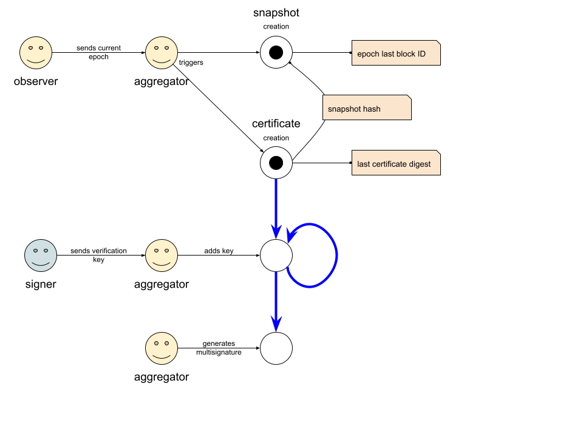

# Aggregator

## Protocol Establishment Phase

### initialization

The first phase of the protocole is triggered when a new Epoch starts in the Cardano network. The aggregator node saves the current stake ditribution and starts performing the snapshot for this new epoch which is then stored in the cloud. A message is then created containing the current and the previous snapshots digests.

### Certificate creation

During this phase, the aggregator waits to reach a stake quorum of signers. They register to be part of the lotery process of the multisignature. During all this time, the certificate is in _pending_ state. Once the quorum is reached, the aggregator issues the multisignature certificate and stores it in the certificate chain.

