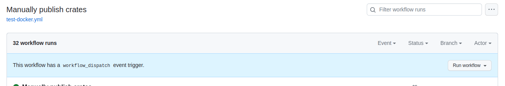
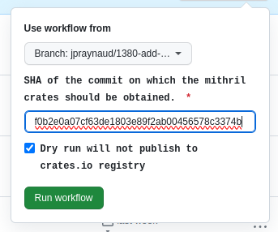
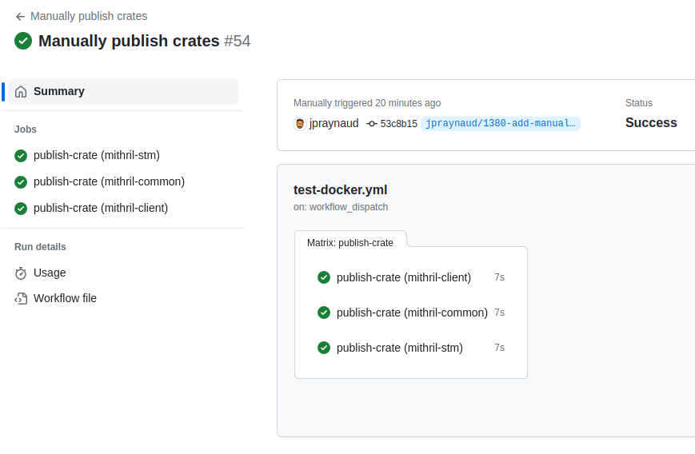

Manually publish Rust crates to crates.io.

## Introduction

From time to time, we may need to publish manually Rust crates to [crates.io](https://crates.io/) registry.

## Run the associated 'Manual crates publication' GitHub Actions workflow

Go to the page of the workflow with your browser: [Manual crates publication](https://github.com/input-output-hk/mithril/actions/workflows/manual-publish-crates.yml)

Then, click on the **Run workflow** button:

Then fill the form to manually run the workflow:

> [!CAUTION]
> It is highly recommended to run with the **Dry run** option checked at first and make sure that the process works as expected.
> The deployment to **crates.io** is irreversible, versions can only be **yanked**

The result should look like this in the GitHub Actions:

