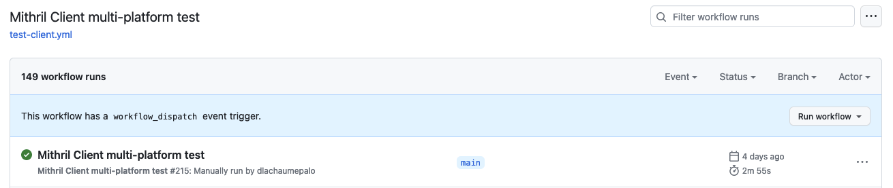
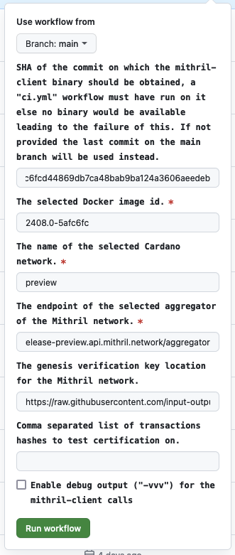
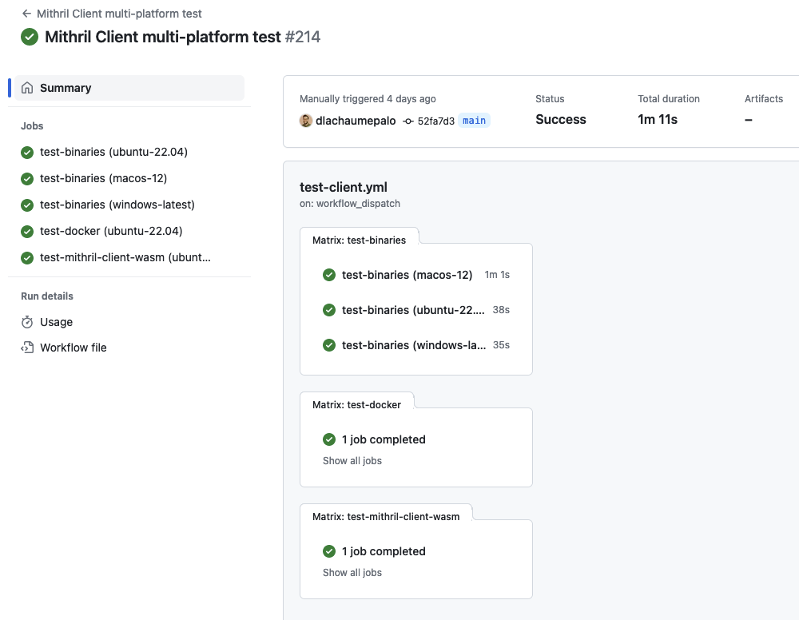

# Run Mithril client multi-platform test

## Introduction

You can manually run this workflow if you want to test the Mithril client features in the following contexts:

- Mithril client binaries on multi-platform (Ubuntu, MacOS and Windows)
- Mithril client docker image
- Mithril client WASM package with headless browsers (Chrome and Firefox)

## Run the associated 'Mithril Client multi-platform test' GitHub Actions workflow

Go to the page of the workflow with your browser: [Mithril Client multi-platform test](https://github.com/input-output-hk/mithril/actions/workflows/test-client.yml)

Then, click on the **Run workflow** button:

Then fill the form to manually run the workflow:

> [!WARNING]
>
> - The **Mithril image id** of the distribution to deploy must be published on the [package registry](https://github.com/orgs/input-output-hk/packages?repo_name=mithril)

> [!IMPORTANT]
> If you want to run the tests with an aggregator that has the signing capability for Cardano transactions, you will also need to provide a list of [Cardano transactions hashes](https://sancho.cexplorer.io/tx) separated by commas.
>
> The aggregator capabilities are available at the root route of the aggregator `/`:
>
> - [Capabilities for testing-preview aggregator](https://aggregator.testing-preview.api.mithril.network/aggregator)
> - [Capabilities for testing-sanchonet aggregator](https://aggregator.testing-sanchonet.api.mithril.network/aggregator)

The result should look like this in the GitHub Actions:

