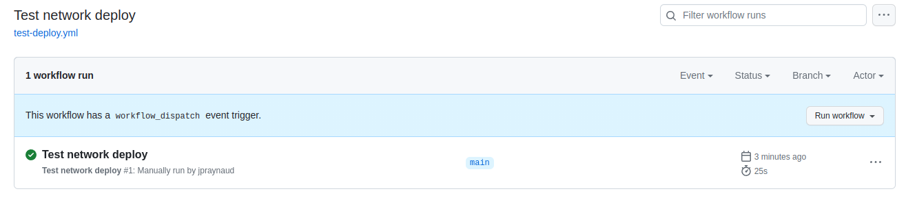
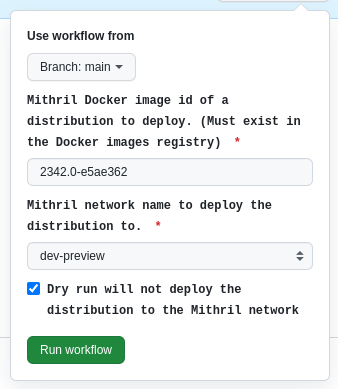
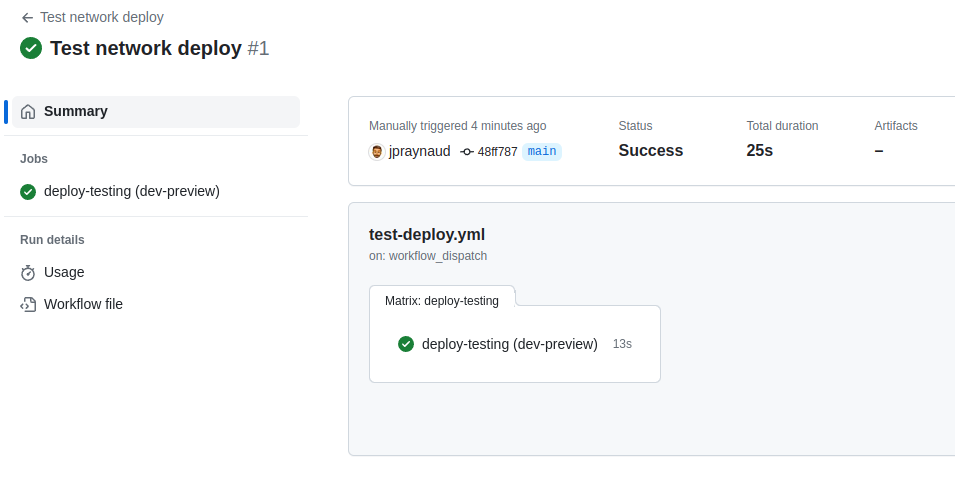

# Manually deploy a test distribution to a test Mithril network.

## Introduction

From time to time, we may need to deploy manually on a test Mithril network a test distribution in order to test unreleased features independently from the regular [release process](https://mithril.network/doc/adr/3). In that case, we have the opportunity to manually deploy to a pre-configured network a specific distribution.

## Run the associated 'Test network deployment' GitHub Actions workflow

Go to the page of the workflow with your browser: [Test network deployment](https://github.com/input-output-hk/mithril/actions/workflows/test-deploy-network.yml)

Then, click on the **Run workflow** button:

Then fill the form to manually run the workflow:

> [!WARNING]  
> - The **Mithril image id** of the of the distribution to deploy must be published on the [package registry](https://github.com/orgs/input-output-hk/packages?repo_name=mithril)

> [!CAUTION]
> It is highly recommended to run with the **Dry run** option checked at first and make sure that the process works as expected
> The deployment of a distribution can lead to irreversible damages or loss for the network

The result should look like this in the GitHub Actions:

