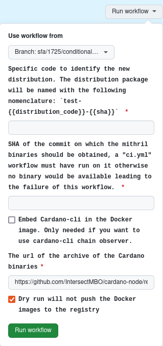

# Create a custom test Docker distribution.

## Introduction

From time to time, we may need to create a test Docker distribution with custom arguments (notably the version of the Cardano CLi that is used).
This is a convenient way for testing early releases of the Cardano node. This is also commonly used to create a Docker distribution from an unmerged PR.

## Run the associated 'Docker images test' GitHub Actions workflow

Go to the page of the workflow with your browser: [Docker image test](https://github.com/input-output-hk/mithril/actions/workflows/test-docker.yml)

Then, click on the **Run workflow** button:

Then fill the form to manually run the workflow:

> [!WARNING]  
> - The SHA of the commit must have been run successfully in the CI workflow beforehand

> [!CAUTION]
> It is highly recommended to run with the **Dry run** option checked at first and make sure that the process works as expected

The result should look like this in the GitHub Actions:

You should also be able to see the newly created Docker images in the [package registry](https://github.com/orgs/input-output-hk/packages?repo_name=mithril)