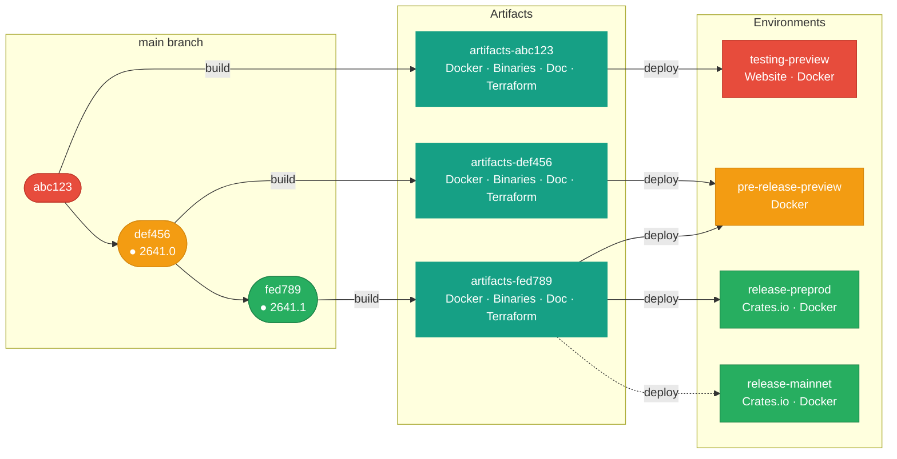

## Status

Accepted

## Context

To consistently deliver software to our users, we need a release process built on a predictable versioning scheme.

### Versioning

A distribution version identifies a distribution of specific node versions and their underlying libraries.

- All software components must interoperate seamlessly with other Mithril software.
- All software components must be publishable to crates.io.
- All software components must clearly communicate their compatibility with other Mithril components to end users.

### Release process

A distribution is a software package built once and then promoted from the testing environment to the production environment. It may be signed.

- Keep it simple.
- Automate as much as possible: every step that does not require a human decision must be automated.
- Minimize the mean time to release.

## Decision

The Mithril stack has three versioned layers:

- **HTTP API protocol**: ensures compatibility in the communication between nodes (uses Semver).
- **Crate version**: each node and library has its own version (uses Semver). The commit digest is automatically appended to the version by the CI pipeline.
- **Distribution Version**: the distribution version (uses the scheme **YYWW.patch** | **YYWW.patch-name**). The VERSION file is derived from the release tag by the pipeline.

Documentation is tied to a Distribution Version.

### Release Process

Starting immediately after a new release has been published:

1. Develop on a dedicated development branch.
1. When merging a PR into main, update the `Cargo.toml` files with the versions of the affected nodes.
1. Once merged, the CI creates an `unstable` tag and release, which is deployed to the testing environment.
1. Push a tag in the distribution version format on this commit.
1. The CI retrieves the built artifacts for this commit and generates a named pre-release, which is deployed to `pre-release-preview` for testing.
1. In the GitHub release interface, edit the newly generated release and uncheck the `This is a pre-release` checkbox.
1. The CI retrieves the built artifacts for this commit and generates a named release, which is deployed to `release-preprod` and `release-mainnet`.
1. Create a commit to promote the documentation website from future to current.

### Hotfix Release

In case of a blocking issue on the release environment following a distribution release that requires an immediate fix:

1. Create a branch from the last release tag using the scheme: `hotfix/{last_distribution-version}.{last_patch_number + 1}`.
1. Develop the fix on this branch.
1. After each commit on this branch, the CI creates an `unstable` tag and release, which is not deployed to the testing environment (testing must be performed on an ad hoc environment created manually).
1. Push a tag on the branch's latest commit using the branch distribution version with a `-hotfix` suffix.
1. The CI retrieves the built artifacts for this commit and generates a named pre-release, which is deployed to `pre-release-preview` for testing.
1. In the GitHub release interface, edit the newly generated release and uncheck the `This is a pre-release` checkbox.
1. The CI retrieves the built artifacts for this commit and generates a named release, which is deployed to `release-preprod` and `release-mainnet`.
1. Merge the hotfix branch into the main branch (adapting changes as needed if they are not directly compatible with the current main branch).

### Infrastructure-only Redeployment

When a change affects only the infrastructure (e.g. a Cardano node upgrade that is compatible with the current Mithril distribution), it is possible to redeploy without creating a new distribution. See [ADR 11](/adr/11) for details.
