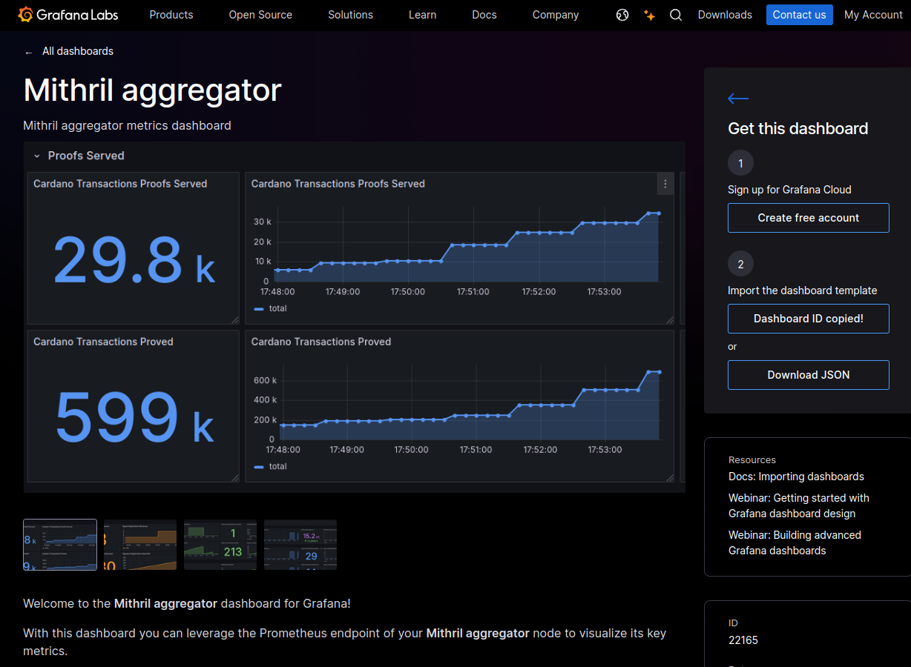

### Mithril aggregator Prometheus endpoint is available

With the release of [distribution 2445](https://github.com/input-output-hk/mithril/releases/tag/2445.0), the Mithril aggregator now includes an optional Prometheus endpoint for monitoring basic metrics.

After configuring the Prometheus endpoint, remember to restart the Mithril aggregator for the changes to take effect.

To make setup easier, a **Grafana template** is available for creating a dashboard to visualize metrics from the Prometheus endpoint (ID 22165): [Grafana dashboard](https://grafana.com/grafana/dashboards/22165-mithril-aggregator/).

For questions or support, feel free to contact the team on the [Discord channel](https://discord.gg/5kaErDKDRq).
