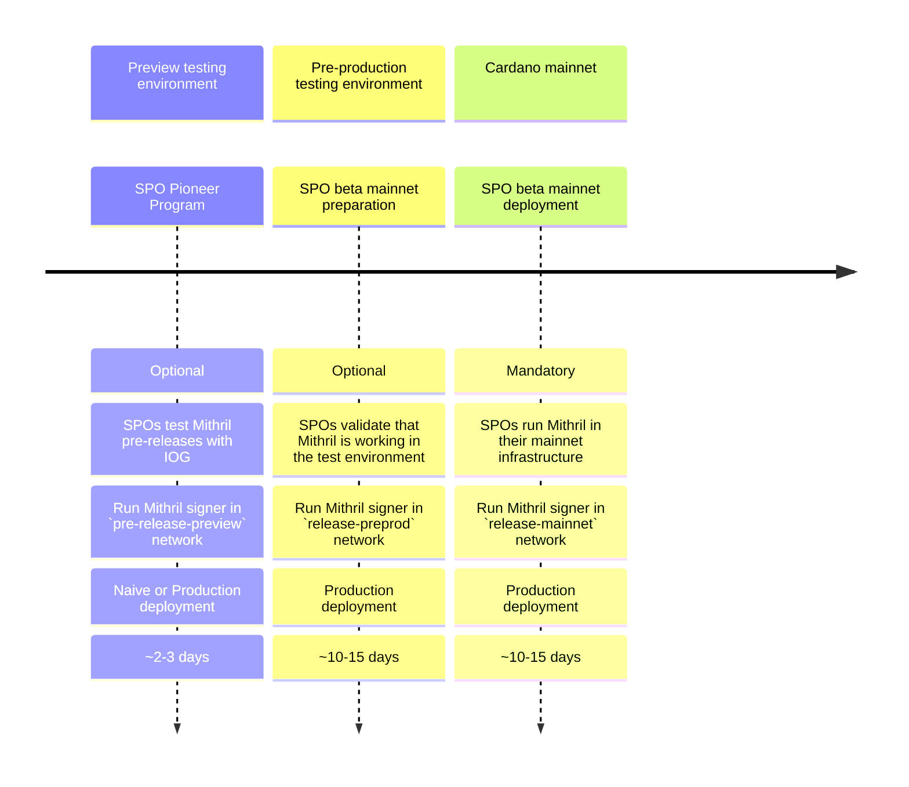

import CompiledBinaries from '../../compiled-binaries.mdx'

# Become a Mithril SPO

## The journey with Mithril toward `mainnet`

Welcome to Mithril! Here is a description of the journey you will need to follow as an SPO to prepare for running a Mithril signer on `mainnet`. We assume that you are already an active SPO on the Cardano `mainnet` and have experience using the `pre-production` testnet.

## Step 1: Participate in the pioneer program

:::info

This step is **optional** but recommended as it helps us deliver quality software. We are actively looking for SPO candidates to test Mithril on the Cardano testnets.

:::

:::note

Each **Mithril network** has its own configuration, which can be found on the [Network configurations](../getting-started/network-configurations.md) page.

:::

To participate in the pioneer program, you will need to:

- Run an active SPO on the Cardano `preview` network for at least one epoch or one day
- Set up a **Mithril signer** node on the `pre-release-preview` Mithril network by following the [**Run a Mithril signer node (SPO)**](run-signer-node.md) guide
- You can choose between the **Naive** (easier to set up) or the **Production** deployment models
- Wait for two epochs (or two days) before your **Mithril signer** is eligible to contribute; check that your **Mithril signer** is registered by the aggregator following [**Verify your signer is registered**](./run-signer-node.md#verify-your-signer-is-registered) steps
- Verify that your **Pool Id** is listed in some of the produced certificates using the [**Mithril explorer**](https://mithril.network/explorer?aggregator=https%3A%2F%2Faggregator.pre-release-preview.api.mithril.network%2Faggregator) or following [**Verify your signer contributes with individual signatures**](./run-signer-node.md#verify-your-signer-contributes-with-individual-signatures) steps
- :warning: Follow [**#ask-mithril**](https://discord.gg/5kaErDKDRq) Discord channel or our [**GitHub repository**](https://github.com/input-output-hk/mithril/releases?q=pre) for new pre-releases to install
- If you have any technical issues or would like to provide feedback, feel free to ask questions on the [**#ask-mithril**](https://discord.gg/5kaErDKDRq) Discord channel.

## Step 2: Get Mithril ready for `mainnet`

:::info

This step is **optional**. It's intended to familiarize SPOs with setting up Mithril on their infrastructure. It's **strongly recommended** to complete it before proceeding to **Step 3**.

:::

To get ready for `mainnet`, you need to:

- Be an active SPO on the Cardano `preprod` network for at least one epoch or five days
- Set up a **Mithril signer** node on Mithril's `release-preprod` network by following the [**Run a Mithril signer node (SPO)**](run-signer-node.md) guide
- You **must** run the **Production** deployment model
- Wait for two epochs (or ten days) before your **Mithril signer** is eligible to contribute; check that your **Mithril signer** is registered by the aggregator following [**Verify your signer is registered**](./run-signer-node.md#verify-your-signer-is-registered) steps
- Verify that your **Pool Id** is listed in some of the produced certificates using the [**Mithril explorer**](https://mithril.network/explorer?aggregator=https%3A%2F%2Faggregator.release-preprod.api.mithril.network%2Faggregator) or following [**Verify your signer contributes with individual signatures**](./run-signer-node.md#verify-your-signer-contributes-with-individual-signatures) steps
- :warning: Follow [**#ask-mithril**](https://discord.gg/5kaErDKDRq) Discord channel or our [**GitHub repository**](https://github.com/input-output-hk/mithril/releases/latest) for new releases to install
- If you have any technical issues or would like to provide feedback, feel free to ask questions on the [**#ask-mithril**](https://discord.gg/5kaErDKDRq) Discord channel.

## Step 3: Run Mithril on `mainnet`

:::warning

This step is **mandatory**. It is **strongly recommended** to complete **Step 2** beforehand.

:::

To run **Mithril** on `mainnet`, you need to:

- Be an active SPO on Cardano `mainnet` for at least one epoch or five days
- Set up a **Mithril signer** node on Mithril's `release-mainnet` network by following the [**Run a Mithril signer node (SPO)**](run-signer-node.md) guide
- You **must** run the **Production** deployment model
- Wait for two epochs (or ten days) before your **Mithril signer** is eligible to contribute; check that your **Mithril signer** is registered by the aggregator following [**Verify your signer is registered**](./run-signer-node.md#verify-your-signer-is-registered) steps
- Verify that your **Pool Id** is listed in some of the produced certificates using the [**Mithril explorer**](https://mithril.network/explorer?aggregator=https%3A%2F%2Faggregator.release-mainnet.api.mithril.network%2Faggregator) or following [**Verify your signer contributes with individual signatures**](./run-signer-node.md#verify-your-signer-contributes-with-individual-signatures) steps
- :warning: Follow [**#ask-mithril**](https://discord.gg/5kaErDKDRq) Discord channel or our [**GitHub repository**](https://github.com/input-output-hk/mithril/releases/latest) for new releases to install
- If you have any technical issues or would like to provide feedback, feel free to ask questions on the [**#ask-mithril**](https://discord.gg/5kaErDKDRq) Discord channel.
