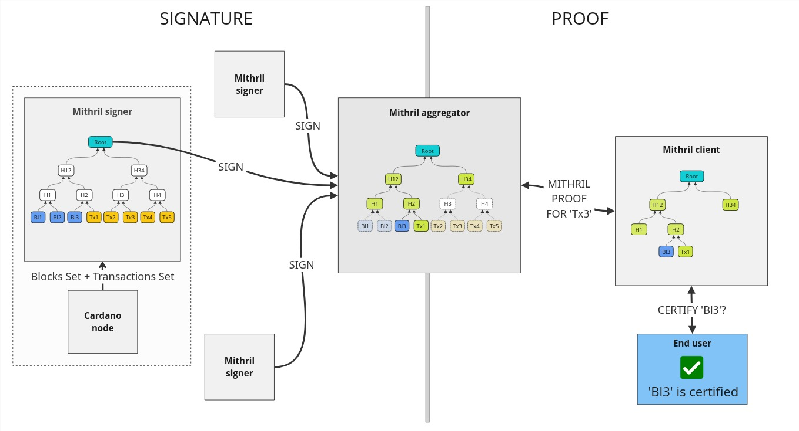
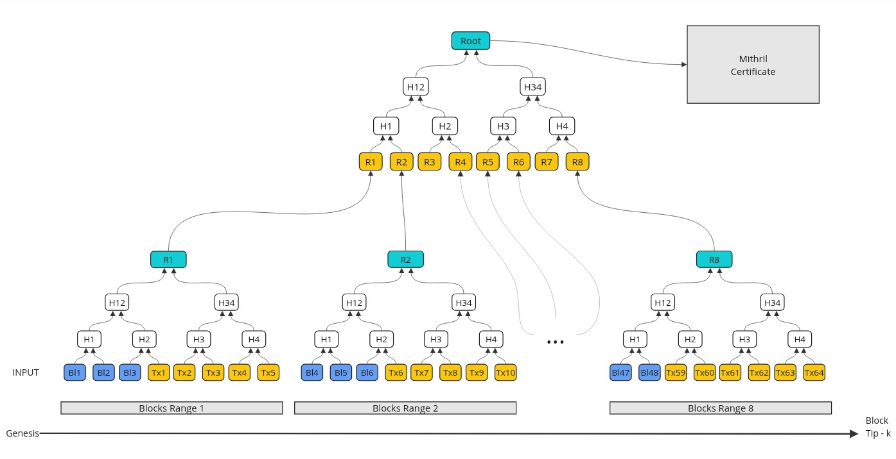
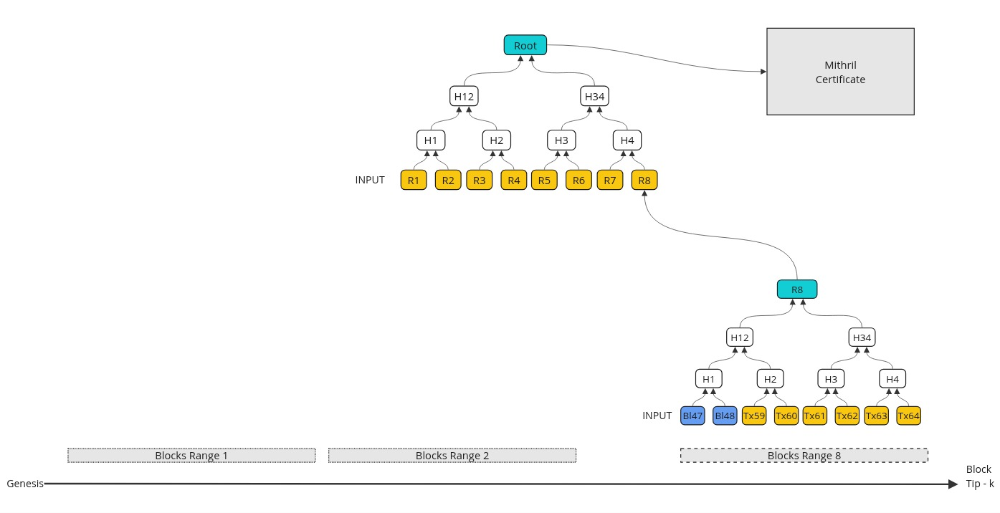
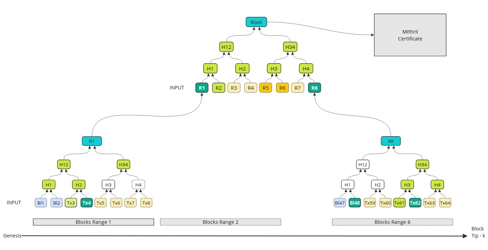

# Cardano blocks and transactions

:::info

This new certification will supersede the current [certification](./cardano-transactions.md) process for Cardano transactions.

:::

The Mithril protocol supports the certification of **Cardano blocks and their transactions (since genesis)**. This enables users to verify the authenticity of both blocks and their transactions without downloading the entire blockchain. This is particularly useful for lightweight clients, such as mobile wallets, which may lack the resources to store it.

To achieve this, Mithril signers and aggregators independently compute a message representing **Cardano blocks and their transactions**, then apply the Mithril protocol to jointly sign it. A proof of membership is then generated on demand for the subset of blocks or transactions that a Mithril client attempts to verify. This proof can be validated against the signed message included in the Mithril certificate.

A key design choice is the **combination of blocks and transactions in the same Merkle structure**. This avoids running multiple signing rounds (one for blocks and one for transactions), which would have increased the overall operating costs for SPOs participating in the Mithril protocol.

A natural structure for the message is a **Merkle tree**, which:

- Can be succinctly represented by its **Merkle root** (the signed message)
- Allows for membership proof of a block or a transaction in the set by providing the **Merkle path** from the block or transaction to the root.

This certification is conducted under high constraints when operating on the Cardano mainnet:

- The current Cardano blockchain exceeds `100 million` transactions spread across millions of blocks
- The Mithril signer footprint must remain minimal (low memory, low CPU, low disk space)
- On-demand generation of the proof of membership must be fast and scalable to high throughput.

### Certified information

Each leaf in the Merkle tree carries rich information about the block or transaction it represents. Blocks and transactions are clearly distinguished using a **Domain Separation Tag** (DST).

**For each block**, the following information is certified:

- **Block hash**: the unique identifier of the block on the Cardano chain
- **Block number**: the sequential number of the block in the chain
- **Slot number**: the slot in which the block was produced.

The leaf identifier for a block is: `Block/{block_hash}/{block_number}/{slot_number}`.

**For each transaction**, the following information is certified:

- **Transaction hash**: the unique identifier of the transaction
- **Block hash**: the hash of the block containing the transaction
- **Block number**: the block number in which the transaction was included
- **Slot number**: the slot number of the block containing the transaction.

The leaf identifier for a transaction is: `Tx/{transaction_hash}/{block_hash}/{block_number}/{slot_number}`.

### Depth from the tip of the chain

Unlike the previous Cardano transaction certification, the **depth from the tip of the chain** is certified alongside the block number. The signed message includes three parts:

- The **Merkle root** of the blocks and transactions set
- The **latest block number** signed
- The **block number offset** (the security parameter representing the distance from the tip).

The block number of the chain tip at the time of the snapshot can be derived as `block_number_signed + block_number_offset`. This allows the end user to **decide for themselves whether a block or transaction is final enough** for their use case, rather than relying on a fixed finality threshold set by the protocol. A user who needs stronger finality guarantees can wait for a greater depth, while a user who tolerates more risk can accept blocks closer to the tip.

:::info

It is also worth noting that a new signature round is **triggered at a constant pace** (every `30` blocks on the Cardano mainnet).

:::

## Mithril certification

<small>End-to-end certification for Cardano blocks and transactions</small>

:::info

Learn about the Mithril certification steps [here](./README.mdx).

:::

### Message computation

Creating a Merkle tree with millions of blocks and `100 million` transactions is impractical due to high memory usage and long computation times that exceed the signer's operational capacity. However, a **Merkle forest** offers a suitable solution. In this structure, the leaves of the signed Merkle tree are the roots of separate Merkle trees, each representing a contiguous block range. Each Merkle tree block range contains both the block leaves and the transaction leaves for the blocks within that range.

Within each Merkle tree block range, leaves follow a **strict ordering**:

1. All **blocks** come first, sorted by block number, then slot number, then block hash
2. All **transactions** come after, sorted by block number, then slot number, then block hash, then transaction hash.

The blocks are divided into **block ranges** of `15` blocks. Each Merkle tree block range contains the block leaves and their associated transaction leaves (`~150-1.5k` transactions per block range on the Cardano mainnet).
This reduces the number of leaves in the Merkle forest to approximately `1 million` on the Cardano mainnet, about `100` times fewer than the total number of blocks and transactions in the blockchain.

#### Partial block ranges

When the signed block number does not align with a block range boundary, the last block range may be **partial** (containing fewer blocks than the standard `15`). This support for partial block ranges helps maintain a **consistent depth from the tip of the chain** when signing, rather than waiting for the next complete block range boundary.

<small>Message creation when aggregating on the aggregator</small>

The process is almost the same on the signer, except that the blocks and transactions of the block ranges are ephemerally stored and only their compressed representation is kept in the long run (the Merkle root of the Merkle tree block range) once the blocks are final (older than `k` blocks from the tip of the chain, `2160` on the Cardano mainnet). This allows drastic compression of the signers' storage.

<small>Message creation when signing on the signer</small>

:::info

The Merkle tree inner nodes are computed with the `BLAKE2s-256` hash function: the child bytes are concatenated and hashed to compute the parent node.

:::

### Authenticity verification

The verification process operates on a subset of the Cardano blocks and transactions that can be certified (fully or partially). Blocks and transactions have **dedicated proof routes** on the aggregator, allowing clients to request a Merkle proof of membership for a set of transactions (identified by their transaction hashes) or a set of blocks (identified by their block hashes).

For each route, the verification follows the same pattern:

- The client calls the dedicated prover route exposed by the aggregator, which computes a **Merkle proof of membership** for the requested blocks or transactions signed in the latest snapshot
- The client verifies that the proof of membership is valid and that its Merkle root (the message) is signed by a valid Mithril certificate
- The client can use the certified **block number offset** and **latest block number** to determine whether the depth from the tip is sufficient for their finality requirements.

<small>Proof creation done by the aggregator</small>

