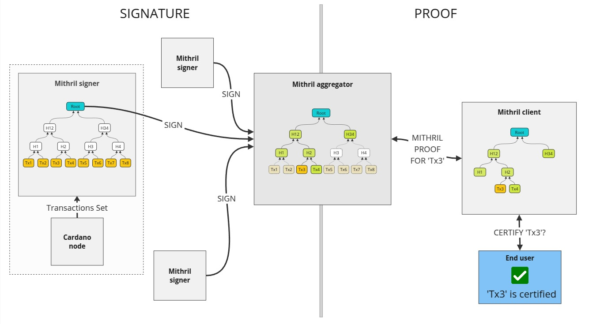

# Cardano transactions

## Introduction

The Mithril protocol supports the certification of the **full Cardano transactions set (since genesis)**. This allows users who aim to verify the authenticity of a transaction to do so without having to download the entire Cardano blockchain.
This is particularly useful for lightweight clients, such as mobile wallets, which may not have the resources to store the entire blockchain.

To do so, the Mithril signers and aggregators independently compute a message which represents the **Cardano transactions set** and apply the Mithril protocol to jointly sign it.
A proof of membership is then generated on demand for the subset of transactions that a Mithril client attempts to verify the authenticity of. This proof can be verified against the aforementioned message which is signed in a Mithril certificate.

A natural structure for the message is a **Merkle tree** which:

- can be represented succinctly by its **Merkle root** (the actual message signed)
- allows to **prove membership** of a transaction in the set by providing the **Merkle path** from the transaction to the root.

This certification is done under high constraints when operated on the Cardano mainnet:

- the current magnitude of the Cardano transactions set is more than `100 million` transactions
- the Mithril signer footprint must remain very limited (low memory, low CPU, low disk space)
- the on demand generation of the proof of membership must be fast and scale to high throughput.

:::info

Another concern relates to the finality of the Cardano chain itself: the closer we look at the tip of the chain, the more likely blocks can be rolled back and transactions could be invalidated. However, the Mithril protocol is designed to provide certification with high guarantees. We have opted as a first implementation to certify the transactions set at a **fixed offset from the tip of the chain** (`100` blocks on the Cardano mainnet), which gives a good trade-off between the finality guarantees and the latency needed for Mithril to certify a transaction after its submission. The distance from the tip of the chain at which the transactions set is certified has an impact on the Mithril protocol itself: the closer to the tip of the chain, the more likely some signers will run a temporary fork of the Cardano chain (which would be rolled back later) which could prevent the reach of the mandatory quorum to create a valid multi-signature. The offset can be adjusted as a Mithril network parameter.

It is also worh mentioning that a new signature round is **triggered at constant pace** (every `30` blocks on the Cardano mainnet).

:::

## Mithril certification

The Mithril certification is generally done with the following steps:

- the **signers** compute the message which represents the type of information to sign, and then broadcast it to the aggregators
- the **aggregators** compute the same message which represents the type of information to sign, collect the signatures from the signers and attempt to aggregate them into a multi-signature
- the **clients** download "artifacts" from an untrusted source (e.g. an aggregator, a cloud service, or a peer-to-peer network), re-compute the same message which represents the type of information to verify, and verify that the message is signed by a valid Mithril multi-signature.

<small>
End to end certification for Cardano transactions
</small>

### Message computation

Unfortunately, creating a Merkle tree with `100 million` leaves is not feasible without high memory usage and long computation time, which is far beyond the operating capacity of the signer.
However, a **Merkle forest** where the leaves of the Merkle tree which is signed are the roots of the Merkle trees whose leaves are the transaction hashes for contiguous block number ranges is providing a good solution.

It is worth pointing out that this structure is almost append-only in the case of transactions and thus some compression can be applied to the storage when it is not used to create a membership proof: this is why the information stored on the signers and the aggregators have different volumes.

The blocks are divided into **block ranges** of `15` blocks. The leaves of the Merkle trees are the hashes of the transactions in the blocks of the range (`~150-1.5k` transactions per block range on the Cardano mainnet).
This allows to create a Merkle forest of on an average `100` times less leaves than the number of transactions in the Cardano blockchain (`~1M` leaves instead on the Cardano mainnet).

<small>
Message creation when aggregating on the aggregator
</small>

The process is almost the same on the signer, except that the transactions of the block ranges are ephemerally stored and only their compressed representation is kept in the long run (the Merkle root of the block range Merkle tree) once the blocks are final (older than `k` blocks from the tip of the chain, `2160` on the Cardano mainnet). This allows drastic compression of the storage on the signers.

<small>
Message creation when signing on the aggregator
</small>

:::info

The Merkle tree inner nodes are computed with the `BLAKE2s-256` hash function: the children bytes representation are concatenated and hashed to compute the parent node.

:::

### Authenticity verification

The verification process operates on a subset of the Cardano set that can be certified (fully or partially):

- the client calls a prover route exposed by the aggregator which computes a **Merkle proof of membership** for the transactions signed in the latest snapshot
- the client verifies the proof of membership is valid and that its Merkle root (the message) is signed by a valid Mithril certificate.

<small>
Proof creation done by the aggregator _(to verify 'Tx4' and `Tx62')_
</small>
