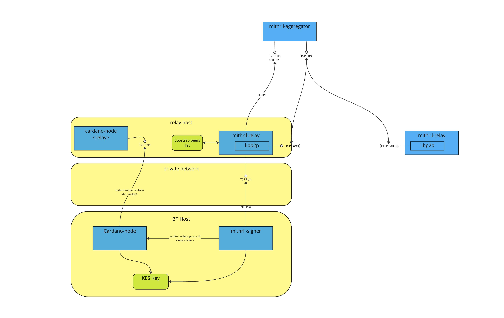

# Mithril Threat Model

:::danger

This document is a draft version of the **Mithril threat model** prepared by the **Mithril core team**:
- We expect to receive **external feedback and contributions** before we can consider it **final**.
- Feel free to **contribute** to this document by using the **Edit this page** link a the bottom of the page.
- A **GitHub discussion** is also available [here](https://github.com/input-output-hk/mithril/discussions/).

::: 

This document provides an analysis of the various security threats and possible mitigations that could affect the Mithril network and its participants. 

This is an adversarial mindset document and aims to analyse the system from an attacker's perspective.

The threat model is a living document and is kept up-to-date with the [latest Mithril version](https://github.com/input-output-hk/mithril/releases/latest)

## System analysis

### System description 

:::info To do

- Maybe reduce and move details into [architecture page](https://mithril.network/doc/mithril/mithril-network/architecture)?
- Also we should update the [protocol page](https://mithril.network/doc/mithril/mithril-protocol/protocol)

:::

System consists of three main components: signers, aggregator and clients.

Mithril signers do certify Cardano chain data using a mithril signing key. That means, mithril signers need access to a trusted `cardano-node` and the mithril signing key to operate.

Mithril signing keys are rotated every epoch and need to be certified by the Cardano KES key. For this, the mithril signers need access to the KES key in order to register the signing key for this epoch. 

Cardano KES keys are also used block producing `cardano-node` and are typically located on the block producing machine.

Cardano KES keys need to be [evolved every 36 hours](https://github.com/input-output-hk/cardano-node-wiki/blob/main/docs/stake-pool-operations/7_KES_period.md), while they can be rotated from a root key when needed.

:::info To do

Is there a Cardano threat model about this?

:::

All mithril signers and mithril clients connect to a single aggregator using HTTP over TLS.

Registering a Mithril signing key means that a signer sends its corresponding verification key to the aggregator, for the purpose of distribution to all other mithril signers.

A mithril aggregator coordinates creation of signatures by all registered signers. Mithril signers do ask the aggregater whether a signature is pending on a regular basis. The aggregator responds with information what to sign and a list of public information about all registered signers.

Each mithril signer verifies the information, produces a signature of the requested information to sign and submits that to the aggregator (which verifies the signature being correct upon receiving).

The aggregator repeatedly checks whether enough valid signatures (to reach the quorum) are available to aggregate a Mithril stake-based multi-signature into a certificate.

Mithril certificates are certifying some chain data using an aggregated multi-signature verification key and are chained up to some genesis certificate, which is signed by a genesis signing key.

Mithril clients do connect to an aggregator using HTTP over TLS to query mithril certificates for certified chain data and locate artifacts.

A mithril client can verify the received mithril certificate is linked to other certificates up to the genesis certificate and can be verified using the Mithril genesis verification key (see [details](https://mithril.network/doc/mithril/mithril-protocol/certificates/)).

:::info To do

Missing: the currently recommended relay (reverse proxy)

:::

#### Deployment architecture

This document is specifically targeting the standard deployment architecture where a mithril signer runs next to the block producing node, while access to the mithril aggregator is only done through a relay.

[](./images/deployment-architecture.jpg)

### External Dependencies

Listing dependencies for mithril-signer
```
% cargo-deps-list -e normal -p mithril-signer 
...
slog-json v2.6.1 {default}
slog-scope v4.4.0
arc-swap v1.6.0

Total dependencies: 267
```


<!-- * [libp2p](https://docs.libp2p.io/)
    * https://docs.libp2p.io/concepts/security/security-considerations/
    * [DoS Mitigation](https://docs.libp2p.io/concepts/security/dos-mitigation/) -->
    
* SPOs infrastructure:
    * Block producing host configuration
    * Relay hosts configuration
    * Firewall/private network

### Entry Points 

* mithril-relay P2P TCP ports
* Aggregator HTTP port
* mithril-relay HTTP port

## Assumptions 

The core Mithril protocol is considered safe and its analysis is out of scope for this document, it is computationally infeasible to:
* Forge a valid aggregate signature from forged signing keys
* Forge individual signatures impersonating one of the signers

## Assets

For each asset we first identify what protection is required: Availability, Confidentiality, Integrity ie. the [CIA Triad](https://www.splunk.com/en_us/blog/learn/cia-triad-confidentiality-integrity-availability.html)

:::info Note

I follow Pascal's suggestion to identify assets as processes rather than particular resources, except in the case of actual pieces of data (eg. keys). The latter should be listed in the threats section and their protection mitigated

:::

We then identify threats and countermeasures

#### KES private keys

* KES key is present only on BP Node but needs to be shared with both the cardano-node process and the mithril-signer process
* KES keys are needed by mithril-signer in order to sign verification key along with an operational certificate which authenticates the key from this stake pool id
* This signing happens at every epoch
    * **availability**: Yes (If KES key is unavailable then signing cannot proceeed)
    * **confidentiality**: Yes (Capturing KES private keys allow an attacker to impersonate a registered SPO on-chain and produce blocks on his behalf)
    * **integrity**: Yes (Rotating a compromised KES key is a time-consuming process, not sure if it's even possible if the KES period has not passed completely? See https://github.com/input-output-hk/cardano-node-wiki/blob/main/docs/stake-pool-operations/7_KES_period.md)

#### Block diffusion

Block diffusion process ensures the timely diffusion of blocks, both those produced "locally" and those received from upstream peers
* **availability**: Yes (Not being to diffuse blocks harms a BP's SPO economic viability, and can also harm their ability to create new blocks)
* **confidentiality**: No (block diffusion happens in the open)
* **integrity**: Yes (partially? not sure what integrity means here)

#### Block production

Block production is the process of "minting" new blocks by block producers, driven by Stake-based random lottery.

The mithril-signer necessarily runs on the same host than a BP because it needs access to the KES signing key

* **availability**: Yes (BP is critical for SPOs revenue, and preventing a BP from producing blocks can harm SPOs capabilities to operate)
* **integrity**: Yes (incorrect or invalid data can hamper BP capabilities)
* **confidentiality**: Yes? (BP schedule is private information for the BP, leaking it could provide adversaries advance knowledge of schedules and lead to **grinding attacks** to attempt to manipulate nonce in the disfavour of a BP ??)

#### Cardano Chain Database

A cardano-node maintains an on-disk database consisting of the chain's history. This database is updated by the node when new blocks are diffused through the network, or minted, and also contains a cache of the ledger state. 

Mithril signer needs needs access to _trusted_ and _up-to-date_ Chain database in order to be able to sign snapshots. 

* **availability**: Yes
* **integrity**: Yes
* **Confidentiality**: No (Data is public and replicated) 

#### Cardano Ledger state

Access to an accurate ledger state is needed by mithril signer to retrieve reliable _Stake distribution_. This access is currently done through a local connection (direct w/ Pallas or indirect with cardano-cli) to a trusted cardano-node

* **availability**: Yes (without SD, signer cannot register keys nor validly use other signers' keys)
* **integrity**: Yes (same, inaccurate SD will make key registration and signing process invalid)
* **confidentiality**: No

#### Mithril signing keys

SPOs register their Mithril keys every epoch to be able to sign snapshots. An attacker could impersonate the SPO and sign invalid snapshots if they got hold of those keys
Signing keys are currently stored on-disk (?) 

* **confidentiality**: Yes 
* **integrity**: Yes (invalid key is useless obviously)
* **availability**: Yes (Signer needs Key at every signing round, unavailability will lead to inability to sign)

#### Mithril signing keys registration

Mithril signer needs to register new key every epoch with aggregator (and ultimately other signers)

* **confidentiality**: Yes (access to a signer's key will allow an attacker to impersonate a signer for the duration of the epoch)
* **integrity**: Yes (partial? key registration process is transient and limited in time) 
* **availability**: Yes (need access to aggregator to register key) 

#### Mithril signatures diffusion

Mithril signers produces signatures every time a new immutable file is created in the Chain DB. Those signatures are generated from a random lottery based on the signer's stake and the protocol parameters.
Preventing mithril signers from signing decreases the number of signatures and could allow attacker to take control of the produced snapshot

* **confidentiality**: No 
* **availability**: Yes
* **integrity**: No (signatures are considered tamper-proof)

#### Mithril protocol parameters 

Protocol parameters are needed to coordinate the production of valid multi-signatures. They are served by the aggregator

* **confidentiality**: No (they actually need to be public)
* **availability**: Yes (partial?)
* **integrity**: Yes (tampering protocol parameters can lead a signer to produce invalid signatures)

#### Era reader configuration files

The era reader [Era address](https://raw.githubusercontent.com/input-output-hk/mithril/main/mithril-infra/configuration/release-mainnet/era.addr) and [Era vkey](https://raw.githubusercontent.com/input-output-hk/mithril/main/mithril-infra/configuration/release-mainnet/era.vkey) are used by signers to extract information about the current Mithril Era which defines the structure of snapshots and therefore signatures

#### Era reader signing key

The key tied to the aforementioned era address 

### Client-side only assets

These are the assets that are relevant only when downloading and verifying certificates and full-node snapshots. 

:::info To do

Verification process being trustless, does it really make sense to include those in the Threat Model?

:::

#### Mithril certificate verification process

Mithril clients download snapshots and verify associated certificates using the mithril-client library, either from a CLI tool or [embedded in a browser](https://mithril.network/explorer/) 

* **availability**: Yes (?)
* **confidentiality**: No
* **integrity**: No (the snapshots and certificates are assumed to be secure, integrity is inherent to the protocol)

#### Mithril snapshots & certificates

Mithril certificates are produced by the aggregator from the individual signatures. Mithril certificates' security rests upon a chain of trust ultimately pointing at the Genesis certificate. Mithril aggregator maintains snapshots and certificates (aggregated multi-signatures) to be served to clients

* **availability**: No (Snapshots and certificates are just a fallback, a cardano-node client can always retrieve the infromation from the cardano network itself, albeit much more slowly)
* **confidentiality**: No
* **integrity**: No (the snapshots and certificates are assumed to be secure, integrity is inherent to the protocol)

#### Mithril Genesis Verification Key

Mithril genesis verification key is stored in [GitHub](https://github.com/input-output-hk/mithril/blob/main/mithril-infra/configuration/release-mainnet/genesis.vkey) and only modifiable through an approved merged PR

* **availability**: Yes (it's needed to verify a whole chain of certificate)
* **confidentiality**: No
* **integrity**: No (integrity is inherent to the protocol)

#### Mithril Genesis Signing Key

The corresponding signing key is stored in IOG's VaultWarden, and used only once, when the genesis certificate is generated. 

* **availability**: No (? The key is not needed unless a re-genesis process is required, but then a new key could be used instead?)
* **confidentiality**: Yes
* **integrity**: Yes (?)

## Threat & Mitigations

### Resource exhaustion on Cardano relay

- DoS of a `mithril-signer` running next to a `cardano-node` being a relay
- Assets at risk: 
   - [Block diffusion](#block-diffusion)
   - [Mithril signatures diffusion](#mithril-signatures-diffusion)

### Resource exhaustion on Cardano block producer

* Assets at risk:
  - [Block production](#block-production)

### Block diffusion
* Diffusion is ensured through the connection between BPs, local relays, and downstream/upstream relays
* preventing them to operate can harm the Cardano network 
* Relay hosts connect the BP to the network, 
* Starving relay hosts prevents mithril signatures and key registration to be shared
* Starving a cardano-node running on a relay host would prevent or delay the diffusion of new blocks thus harming 
* Compromising relay hosts would be an extreme form of starving resources

### Block production
* An incorrect mithril-signer could _starve_ the cardano-node of computing resources thus preventing it from producing and diffusing blocks in a timely manner
* Compromising BP host would 

### Hardening Operating System

[Developers portal](https://developers.cardano.org/docs/operate-a-stake-pool/hardening-server) already provides thorough documentation on how to harden a linux-based host to run cardano-node

## References

* [OWASP Threat Modelling Process](https://owasp.org/www-community/Threat_Modeling_Process)
* [SPO Guide](https://developers.cardano.org/docs/operate-a-stake-pool/)
* [Lightning Book Security chapter](https://github.com/lnbook/lnbook/blob/develop/16_security_privacy_ln.asciidoc)
* [Lightning Gossip Protocol](https://github.com/lnbook/lnbook/blob/develop/11_gossip_channel_graph.asciidoc)
* [Consul Security Model](https://developer.hashicorp.com/consul/docs/security/security-models/core)
* [Parsec Threat Model](https://parallaxsecond.github.io/parsec-book/parsec_security/parsec_threat_model/threat_model.html)
* A list of [Threat Models](https://github.com/hysnsec/awesome-threat-modelling#threat-model-examples)
* there's even a [Threat model manifesto](https://www.threatmodelingmanifesto.org) :open_mouth: ! 