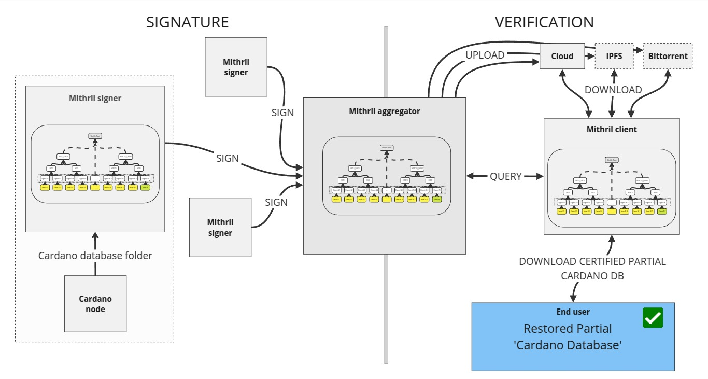
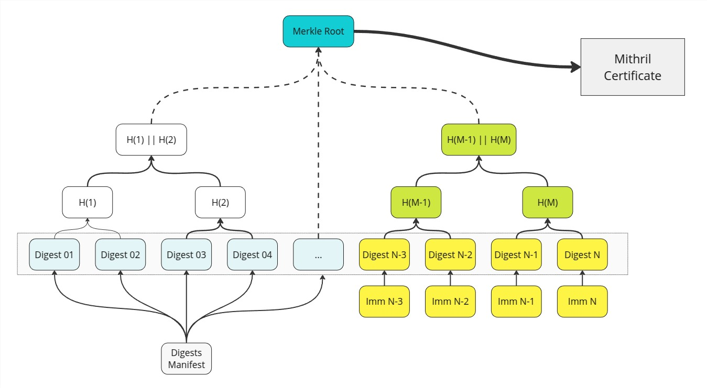

# Cardano node database v2

:::danger

- This feature is **experimental** and not yet available on the mainnet
- It will supersede the current certification process for the Cardano node internal database.

:::

The Mithril protocol supports the incremental certification of the **Cardano node internal database**, enabling fast bootstrapping of a Cardano node on a **specific range of immutable files**. This is particularly useful for full-node wallets, SPOs, and layer 2 protocols that need to operate full Cardano nodes and want to synchronize them quickly after an offline period.

To achieve this, Mithril signers and aggregators independently compute a message representing the immutable files of the Cardano node internal database and apply the Mithril protocol to jointly sign it.

A natural structure for the message is a **Merkle tree**, which:

- Can be succinctly represented by its **Merkle root** (the signed message)
- Enables membership proof of an immutable file by providing the **Merkle path** from the transaction to the root.

:::info

The Cardano node internal database:

- Exceeds `150 GB` on the Cardano mainnet
- Holds less than `20,000` immutable files on the Cardano mainnet
- Can be fully bootstrapped in `~20 minutes` with Mithril
- Takes over `24 hours` without Mithril.

:::

## Mithril certification

<small>
End-to-end certification for Cardano transactions
</small>

:::info

Learn about the Mithril certification steps [here](./README.mdx).

:::

### Message computation

The message is the root of the Merkle tree composed of the hash of the immutable files in the Cardano node internal database:

- The hash of the immutable files is computed with `SHA256` of their binary content
- The last immutable file, the ledger state, and the volatile cannot be signed as the Cardano node does not deterministically compute them.

The message computation is the same on the signers and the aggregators.

<small>
Message creation on the signers and aggregators
</small>

:::info

The Merkle tree inner nodes are computed with the `BLAKE2s-256` hash function: the child bytes are concatenated and hashed to compute the parent node.

:::

### Authenticity verification

Since the number of immutable files in the Cardano node’s internal database is small, computing the Merkle tree is fast and can be performed on the client side.

The verification process for a subset of immutable files in the Cardano internal database operates as follows:

- The client downloads data from one or more untrusted sources (eg, an aggregator or a cloud service):
  - A compressed artifact of the partial range of immutable files to restore
  - A map of the digests of immutable files in the Cardano node internal database
- The client computes the same Merkle tree as the signers and aggregators using the fetched digests
- The client computes a Merkle proof of membership for the downloaded immutable files, ensuring that:
  - The proof is derived from the computed Merkle tree
  - The proof is valid
  - The Merkle root is signed by a valid Mithril certificate.

<small>
Proof creation on the clients
</small>
