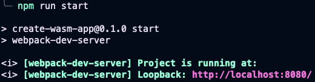
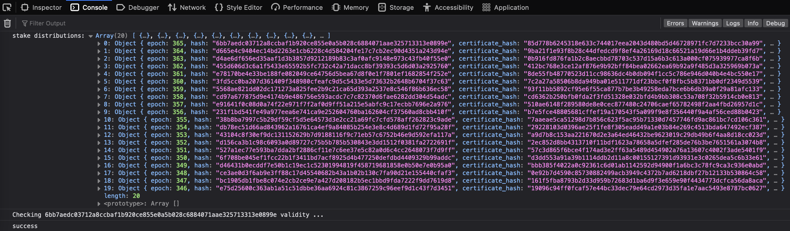
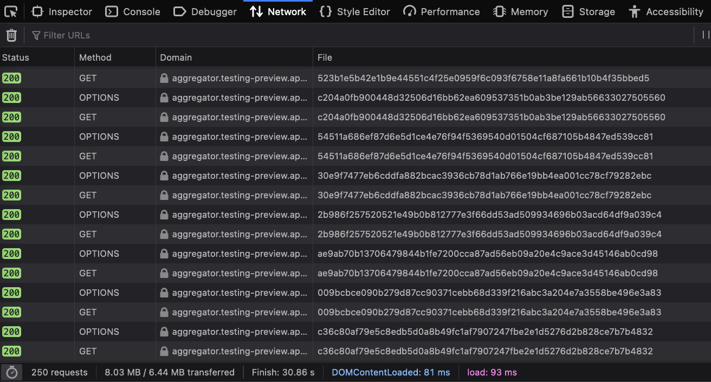

# Run the PoC for Mithril client in the browser with WASM

## Installation
- Install a correctly configured Rust toolchain (latest stable version). You can follow the instructions provided [here](https://www.rust-lang.org/learn/get-started).

- Install Rust WASM Pack:
```bash
cargo install wasm-pack
```

- Install **clang**:
```bash
sudo apt install clang
```

- Install `nodejs` version `12.22+`
```bash
sudo apt install nodejs
```

- Install `npm` version `8.11+`
```bash
sudo apt install npm
```

:warning: If you have troubles building the `BLST` library, you will need to:
- Install [`Emscripten`](https://emscripten.org/docs/getting_started/downloads.html)
- For macOS users, consider reading this [guide](https://github.com/emscripten-core/emscripten/issues/5696) to activate the `emcc` command
- Use these environment variables to use this compiler (or prefix all following commands with them):
```bash
export CC=emcc
export AR=emar
```

## Build mithril_client WASM library

Go to the `mithril-client` directory:
```bash
cd mithril-client
```

Then you can build the WASM library:
```bash
wasm-pack build --no-typescript
```
## Build and run the WASM library in the browser

Go to the `www` directory:
```bash
cd www
```

First install the packages:
```bash
npm install
```

Then, build and serve:
```bash
npm run start
```


Open [http://localhost:8080](http://localhost:8080) with your browser. (port 8080 is the default port)

In the **Console Tab** of your **browser**, you will see the list of stake distributions:


In the **Network Tab** of your **browser**, you will see the list of http requests sent by the WASM library:
